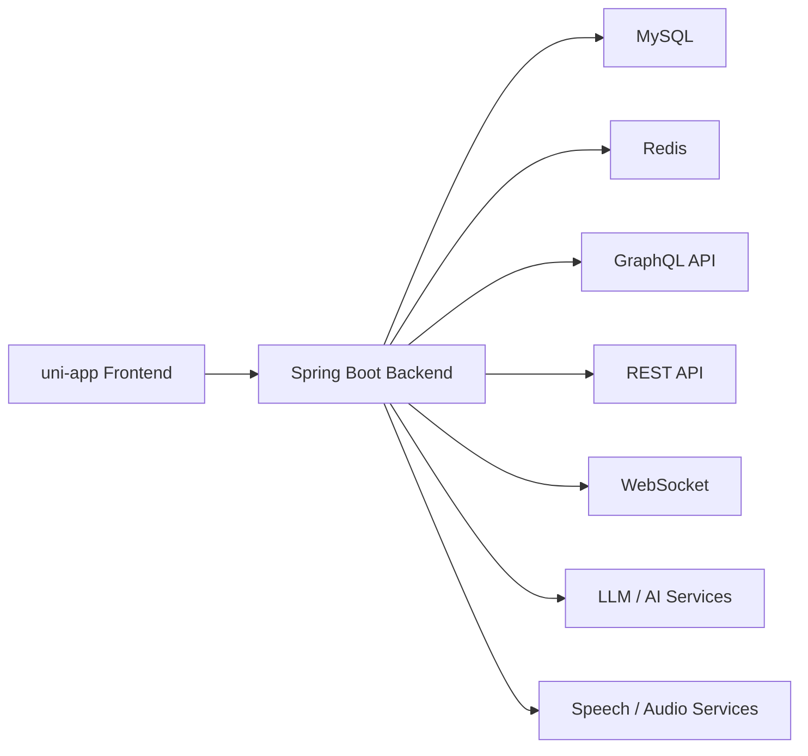

# Interview Agent

一个面向求职训练场景的 AI 面试平台，覆盖岗位选择、题目作答、简历评测、场景化演练、综合测评报告与管理后台等完整闭环。项目采用前后端分离架构，前端基于 `uni-app + Vue 3`，后端基于 `Spring Boot 3`，并集成大模型、GraphQL、WebSocket、MySQL 与 Redis，用于构建可扩展的智能面试体验。

## 项目亮点

- 多维度面试训练：支持专项问答、简历评测、场景模拟、综合评测与结果报告。
- AI 驱动交互：集成大模型能力与语音能力，用于问答生成、结果分析和互动式面试。
- 完整业务闭环：包含用户端、历史记录、排行榜、聊天大厅和管理员后台。
- 混合接口形态：同时提供 REST API 与 GraphQL，适配不同前端交互场景。
- 可扩展后端能力：内置 JWT 鉴权、限流、WebSocket、文件上传与技能配置机制。

## 适用场景

- 面向求职者的 AI 模拟面试训练平台
- 面向校园招聘或职业教育的练习与评估系统
- 面向企业内部培训的面试题库与能力评测平台

## 系统架构



## 核心能力

### 用户端功能

- 登录、注册、找回密码、个人信息维护
- 岗位选择与多岗位面试训练入口
- AI 面试、专项题目作答、场景模拟、简历评测
- 综合测评流程与报告查看
- 历史记录、排行榜、聊天大厅、祝福墙等互动模块

### 管理端功能

- 用户列表与权限管理
- 岗位分类与岗位职位管理
- 专项题库与场景题管理
- 用户行为与记录管理

### 智能能力

- AI 问答与对话式面试
- 简历内容提取与评估
- 场景题生成、评分与报告输出
- 音频转写、语音合成、表情/场景分析能力接入

## 技术栈

### 前端

- `uni-app`
- `Vue 3`
- `Vite`
- `Pinia`
- `Element Plus`
- `Chart.js` / `ECharts`

### 后端

- `Spring Boot 3`
- `Spring Security`
- `Spring GraphQL`
- `MyBatis`
- `JWT`
- `Bucket4j`
- `WebSocket`
- `Spring AI Alibaba Agent Framework`

### 基础设施

- `MySQL`
- `Redis`
- `Maven`
- `HTTPS` 本地证书配置

## 项目结构

```text
interview_agent/
├── backend/                      # Spring Boot 后端服务
│   ├── src/main/java/com/multimodal/interview/
│   │   ├── controller/           # REST 控制器
│   │   ├── service/              # 业务服务
│   │   ├── mapper/               # MyBatis Mapper
│   │   ├── entity/               # 数据实体
│   │   ├── dto/                  # 请求/响应对象
│   │   ├── config/               # 安全、GraphQL、WebSocket 等配置
│   │   └── reactagent/           # Agent 能力与技能路由
│   └── src/main/resources/
│       ├── application.yml       # 本地配置
│       ├── application-prd.yml   # 生产配置模板
│       ├── graphql/              # GraphQL Schema
│       ├── skills/               # Agent 技能定义
│       └── sql/                  # 数据库初始化脚本
└── project/                      # uni-app 前端工程
    └── src/
        ├── pages/                # 用户端与管理端页面
        ├── components/           # 通用组件
        ├── stores/               # 状态管理
        ├── utils/                # API、GraphQL、请求封装
        └── static/               # 静态资源
```

## 页面与模块概览

前端已包含以下核心页面模块：

- 落地页、登录注册、首页、个人中心
- 岗位选择、AI 面试、模拟面试、专项题目作答
- 简历评测、场景评测、综合报告、历史记录
- 排行榜、聊天大厅
- 管理员中心、用户管理、题库管理、岗位管理、场景管理

## 快速开始

### 环境要求

- `JDK 17`
- `Node.js 18+`
- `MySQL`
- `Redis`
- `Maven 3.9+`

### 1. 克隆项目

```bash
git clone https://github.com/MenXiaoHuan/interview_agent.git
cd interview_agent
```

### 2. 初始化数据库

执行数据库脚本：

```text
backend/src/main/resources/sql/interview_agent.sql
```

并确保本地已创建对应数据库。

### 3. 启动后端

进入后端目录并启动 Spring Boot 服务：

```bash
cd backend
./mvnw spring-boot:run
```

默认本地服务配置：

- 服务地址：`https://localhost:8442`
- GraphQL 入口：`https://localhost:8442/graphql`
- Swagger UI：`https://localhost:8442/swagger-ui/index.html`

### 4. 启动前端

进入前端目录并安装依赖：

```bash
cd project
npm install
```

启动 H5 开发环境：

```bash
npm run dev:h5
```

前端当前默认请求后端地址：

```text
https://localhost:8442
```

对应配置文件：

```text
project/src/utils/api-config.js
```

## 配置说明

后端默认配置位于：

```text
backend/src/main/resources/application.yml
```

当前项目依赖以下关键配置项：

- MySQL 数据源
- Redis 连接
- JWT 密钥与过期时间
- 本地 HTTPS 证书
- AI 模型服务配置
- 语音与音频能力服务配置
- 文件上传根目录

建议在实际部署时：

- 将数据库、Redis、JWT、AI Key 等敏感配置迁移到环境变量或独立密钥管理系统
- 区分本地、测试、生产环境配置
- 对上传目录、证书与第三方接口超时做独立运维配置

## 后端接口能力

从当前代码结构来看，后端已覆盖以下主要接口域：

- 用户认证与账户管理
- 岗位与岗位分类管理
- AI 面试与会话管理
- 音频转写与语音合成
- 简历上传、解析与历史管理
- 场景评测、专项问答、综合评测历史
- 排行榜、反馈、聊天消息、祝福墙
- 管理员侧用户与记录管理

## 开发建议

- 前后端联调时优先确认本地 HTTPS 证书是否已被浏览器信任
- 若前端请求失败，先检查 `project/src/utils/api-config.js` 中的后端地址配置
- 若后端启动失败，优先检查数据库、Redis 与第三方 AI 服务配置
- 若需要初始化业务数据，先执行 SQL 脚本后再启动服务

## Roadmap

- 补充环境变量化配置，移除明文敏感信息
- 增加 Docker / Docker Compose 一键部署方案
- 完善自动化测试与 CI/CD 流程
- 增强 README 中的系统截图、接口示例与部署文档

## License

当前仓库未声明开源许可证。如计划公开发布，建议补充 `LICENSE` 文件并明确使用条款。
