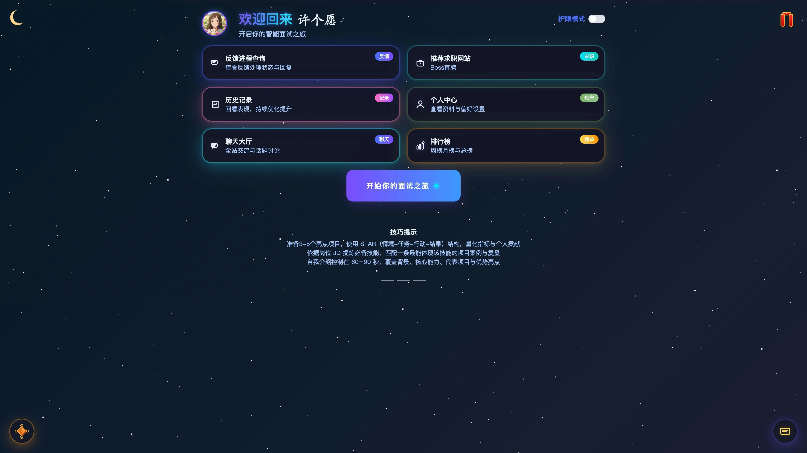
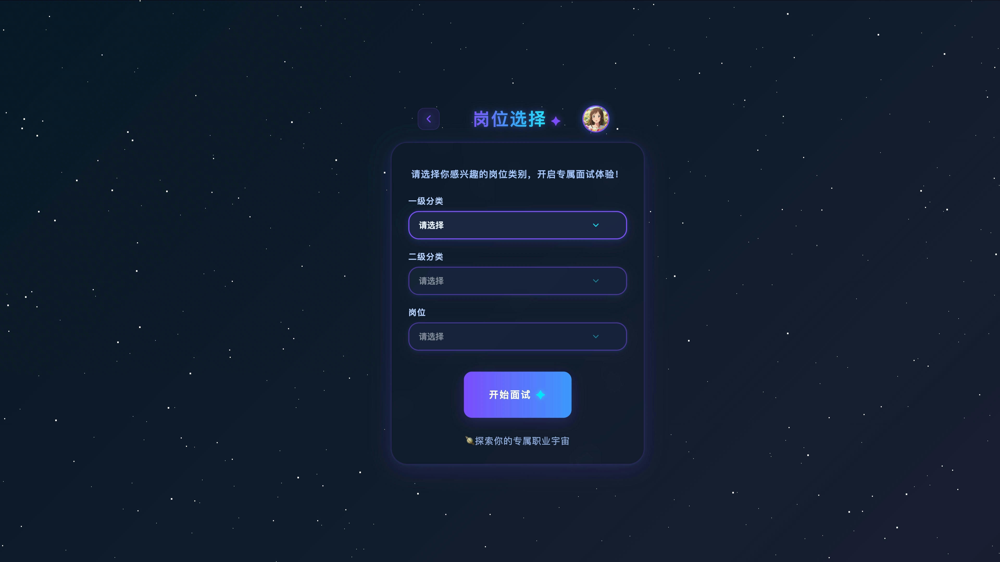
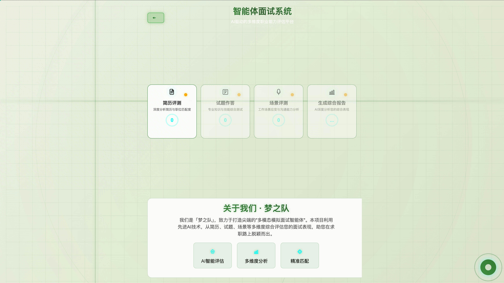
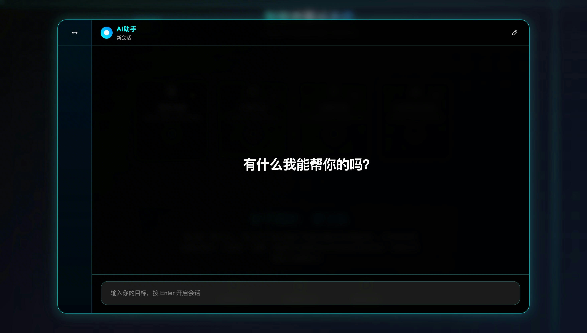
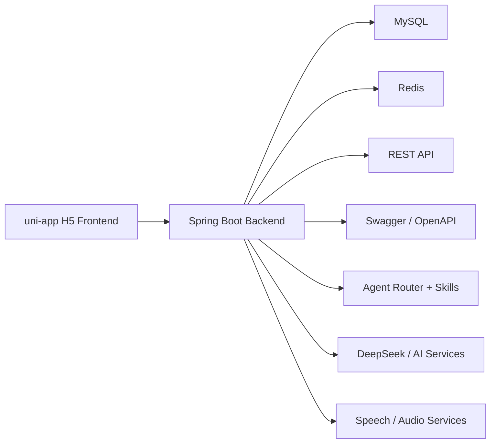

# Interview Agent

一个面向求职训练场景的 AI 面试平台，覆盖岗位选择、AI 面试、专项题作答、简历评测、场景评测、综合报告、排行榜、聊天大厅和管理后台。当前仓库采用前后端分离架构：

- 前端：`uni-app + Vue 3 + Vite`
- 后端：`Spring Boot 3 + Spring Security + MyBatis`
- 存储与中间件：`MySQL + Redis`
- AI 与多模态：`Spring AI Alibaba Agent Framework`、简历解析、语音合成、音频转写、场景评测

本文档按当前仓库代码结构更新，重点说明实际可见的页面、接口和启动方式。

## 项目概览

### 当前已实现的业务模块

- 用户认证：注册、登录、找回密码、RSA 公钥获取
- 用户中心：昵称、头像、密码、邮箱、手机号、护眼模式、惊喜模式
- 岗位体系：岗位分类树、岗位列表、岗位详情、岗位管理
- 训练流程：AI 面试、专项题作答、简历评测、场景评测、综合测评
- 结果沉淀：历史记录、综合报告、专项/综合排行榜
- 社区互动：聊天大厅、祝福墙、反馈
- 管理后台：用户列表、用户权限、专项题管理、场景题管理、岗位分类管理、岗位管理
- AI 会话：Agent 会话持久化、消息记录、事件记录、压缩记忆

### 适用场景

- 求职者模拟面试与能力诊断
- 校招训练营、职业教育实训
- 企业内部培训或题库演示系统

## 系统截图

> 当前仓库已包含部分页面素材，下面直接引用仓库现有图片。

### 首页



### 岗位选择



### AI 面试



### 聊天大厅



## 系统架构



## 前端页面

当前 `project/src/pages.json` 中已注册的页面包括：

- `pages/landing/index`：落地页
- `pages/login/index`：登录
- `pages/register/index`：注册
- `pages/home/index`：首页
- `pages/job-selection/index`：岗位选择
- `pages/interview-interface/index`：模拟面试
- `pages/interview-ai/index`：AI 面试
- `pages/interview-resume/index`：简历评测
- `pages/interview-questions/index`：专项题作答
- `pages/interview-scenario/index`：场景评测
- `pages/comprehensive-resume/index`：综合测评中的简历评测
- `pages/comprehensive-questions/index`：综合测评中的试题作答
- `pages/comprehensive-scenario/index`：综合测评中的场景评测
- `pages/comprehensive-report/index`：综合报告
- `pages/history/index`：历史记录
- `pages/personal-center/index`：个人中心
- `pages/chat-hall/index`：聊天大厅
- `pages/leaderboard/index`：排行榜
- `pages/admin/**`：管理员中心、用户列表、权限管理、专项题管理、场景题管理、岗位分类管理、岗位管理

## 后端能力

当前后端控制器覆盖的接口域包括：

- `/api/auth`：登录、注册、找回密码、RSA 公钥
- `/api/user`：用户资料与个人设置
- `/api/job-categories/*`、`/api/job*`、`/api/jobs*`：岗位分类与岗位管理
- `/api/interview/*`：专项题题库、答题提交、结果与历史
- `/api/resume/*`：简历提取、简历历史保存与恢复
- `/api/comprehensive-history/*`：综合测评履历与综合报告
- `/api/xunfei/getAgentAnswer`：统一 AI / Agent 调用入口
- `/api/agent-conversations/*`：Agent 会话持久化
- `/api/rank/*`：专项与综合排行榜
- `/api/chat/*`：聊天大厅消息
- `/api/blessings/*`：祝福墙
- `/api/feedback/*`：用户反馈
- `/api/scenario-question/*`、`/scenario/*`：场景题与场景评测历史
- `/api/speech/*`、`/api/transcription/*`：语音合成与音频转写

另外，后端 `backend/src/main/resources/skills/` 下已经包含多个内置技能定义，例如：

- `interview-assistant`
- `resume-analysis`
- `comprehensive-resume-analysis`
- `scenario-question-gen`
- `scenario-question-scoring`
- `scenario-evaluation`
- `scenario-audio-evaluation`
- `comprehensive-question-generation`
- `question-analysis`
- `comprehensive-report`

## 技术栈

### 前端

- `uni-app`
- `Vue 3`
- `Vite 5`
- `Pinia`
- `Element Plus`
- `Axios`
- `Chart.js`
- `ECharts`

### 后端

- `Spring Boot 3.4.x`
- `Spring Security`
- `MyBatis`
- `JWT`
- `Bucket4j`
- `Spring Retry`
- `Spring AI Alibaba Agent Framework`
- `Spring AI DeepSeek`
- `SpringDoc OpenAPI / Swagger UI`
- `Redisson`

### 文档与文件处理

- `PDFBox`
- `Apache POI`

### 基础设施

- `MySQL`
- `Redis`
- `HTTPS` 本地证书
- `Maven Wrapper`

## 项目结构

```text
interview_agent/
├── backend/
│   ├── src/main/java/com/multimodal/interview/
│   │   ├── common/              # 统一返回、异常、安全过滤器、拦截器
│   │   ├── config/              # 安全、限流、模型、Web 配置
│   │   ├── controller/          # REST 接口
│   │   ├── dto/                 # 请求/响应 DTO
│   │   ├── entity/              # 数据实体
│   │   ├── mapper/              # MyBatis Mapper
│   │   ├── reactagent/          # Agent 路由、输出结构、记忆服务
│   │   ├── service/             # 业务服务接口
│   │   ├── service/impl/        # 业务服务实现
│   │   ├── util/                # 文件、图片、JSON 等工具类
│   │   └── InterviewAgentApplication.java
│   └── src/main/resources/
│       ├── application*.yml     # 分环境配置
│       ├── sql/                 # 数据库初始化脚本
│       └── skills/              # 内置 Agent Skills
├── project/
│   ├── src/
│   │   ├── pages/               # 用户端与管理端页面
│   │   ├── components/          # 通用组件
│   │   ├── stores/              # 状态管理
│   │   ├── utils/               # 请求封装、接口常量、音频处理
│   │   ├── styles/              # 主题样式
│   │   └── static/              # 静态资源与展示图片
│   ├── vite.config.js           # Vite + HTTPS 配置
│   └── package.json
└── README.md
```

## 快速开始

### 环境要求

- `JDK 17+`
- `Node.js 18+`
- `MySQL 8+`
- `Redis 6+`
- `Maven 3.9+` 或直接使用项目自带 `./mvnw`

### 1. 克隆项目

```bash
git clone https://github.com/MenXiaoHuan/interview_agent.git
cd interview_agent
```

### 2. 初始化数据库

执行以下脚本：

```text
backend/src/main/resources/sql/interview_agent.sql
```

默认数据库名为：

```text
interview_agent
```

### 3. 检查后端配置

共享配置与分环境配置文件：

```text
backend/src/main/resources/application.yml
backend/src/main/resources/application-dev.yml
backend/src/main/resources/application-test.yml
backend/src/main/resources/application-prod.yml
```

当前默认关键项如下：

- MySQL：`jdbc:mysql://localhost:3306/interview_agent`
- Redis：`localhost:6379`
- 后端端口：`8442`
- SSL：默认开启，证书 `classpath:springboot-local.p12`
- 文件目录：`/home/file`
- AI：DeepSeek 与讯飞相关配置通过环境变量注入

推荐优先通过环境变量覆盖这些配置，而不是直接提交敏感值。

### 4. 启动后端

```bash
cd backend
./mvnw spring-boot:run
```

默认地址：

- 服务地址：`https://localhost:8442`
- Swagger UI：`https://localhost:8442/swagger-ui/index.html`
- OpenAPI：`https://localhost:8442/v3/api-docs`

### 5. 启动前端

```bash
cd project
npm install
npm run dev:h5
```

默认地址：

- 前端地址：`https://localhost:5173`

### 6. 联调前务必检查端口

- 后端开发默认端口：`8442`
- 前端开发默认接口地址：`https://localhost:8442`
- 如需连接其他后端地址，请在前端环境文件中设置 `VITE_API_BASE_URL`

### 7. HTTPS 说明

- 前端 `vite.config.js` 已启用本地证书：`localhost+2.pem` 与 `localhost+2-key.pem`
- 后端 `application.yml` 已默认开启 SSL
- 浏览器首次访问本地 HTTPS 服务时，可能需要手动信任证书

## 接口示例

下面给出几组和当前代码一致的接口示例。

### 1. 获取 RSA 公钥

```bash
curl -k https://localhost:8442/api/auth/rsa-public-key
```

说明：

- 登录、注册、重置密码前，前端会先调用该接口获取 RSA 公钥
- `project/src/utils/request.js` 中已实现敏感密码字段的前端 RSA 加密

### 2. 获取岗位分类树

```bash
curl -k https://localhost:8442/api/job-categories/tree
```

### 3. 获取岗位列表

```bash
curl -k "https://localhost:8442/api/job?categoryId=2"
```

### 4. 调用统一 Agent 接口

```bash
curl -k -X POST https://localhost:8442/api/xunfei/getAgentAnswer \
  -H "Content-Type: application/json" \
  -H "Authorization: Bearer <your-jwt-token>" \
  -d '{
    "agentKey": "interview-assistant",
    "chatId": "demo-chat-001",
    "params": {
      "message": "帮我开始一轮前端工程师模拟面试",
      "targetJobHint": "前端工程师"
    }
  }'
```

### 5. 保存 Agent 会话

```bash
curl -k -X POST https://localhost:8442/api/agent-conversations/session \
  -H "Content-Type: application/json" \
  -H "Authorization: Bearer <your-jwt-token>" \
  -d '{
    "agentKey": "interview-assistant",
    "chatId": "demo-chat-001",
    "title": "前端模拟面试",
    "preview": "我们先做一轮自我介绍"
  }'
```

### 6. 简历内容提取

```bash
curl -k -X POST https://localhost:8442/api/resume/extract \
  -H "Authorization: Bearer <your-jwt-token>" \
  -F "file=@/path/to/resume.pdf"
```

## 部署说明

完整环境变量、Docker Compose、Swagger 与 CORS 部署说明见 [`docs/deployment.md`](./docs/deployment.md)。

### 本地开发部署

1. 准备 MySQL、Redis
2. 初始化数据库脚本
3. 配置后端 `application.yml` 或环境变量
4. 确认前端 `VITE_API_BASE_URL` 与后端端口一致
5. 启动后端
6. 启动前端
7. 浏览器信任本地 HTTPS 证书

也可以使用 Docker Compose 启动 MySQL、Redis、MinIO、后端与前端。MinIO 用于存储上传头像，前端服务会通过 Compose 注入 `VITE_API_BASE_URL`：

```bash
docker compose up
```

### 服务器部署建议

#### 后端

- 使用环境变量覆盖数据库、Redis、JWT、AI Key、证书路径等配置
- 通过 `java -jar` 或 `./mvnw spring-boot:run` 启动
- 建议在 `systemd`、`supervisor` 或容器平台中托管进程

示例：

```bash
cd backend
./mvnw clean package -DskipTests
java -jar target/interview-agent-java-0.0.1-SNAPSHOT.jar
```

#### 前端

- 先执行构建
- 将构建产物部署到静态服务器或 Nginx
- 若只运行 H5，可将接口地址切到正式后端域名

示例：

```bash
cd project
npm install
npm run build:h5
```

#### 反向代理建议

- 由 Nginx 统一处理 HTTPS 证书与域名
- `/api/` 反代到 Spring Boot 服务
- 前端静态资源由 Nginx 直接托管

## 开发注意事项

- 前端开发默认使用 `https://localhost:8442` 作为后端接口地址
- 后端很多接口需要 JWT，未认证会返回 `401`
- 登录、注册、重置密码依赖前端 RSA 加密流程
- 若后端无法启动，优先检查端口、数据库、Redis、SSL 证书和第三方 AI 配置
- 若前端 HTTPS 打不开，优先检查 `project/localhost+2.pem` 与 `localhost+2-key.pem`
- 若文件上传报错，检查 `app.file.root` 对应目录是否可写

## 后续可完善项

- 补充正式环境 Nginx 配置模板
- 增加更完整的接口文档和业务演示视频

## License

当前仓库尚未声明开源许可证。如计划公开发布，建议补充 `LICENSE` 文件并明确使用条款。
