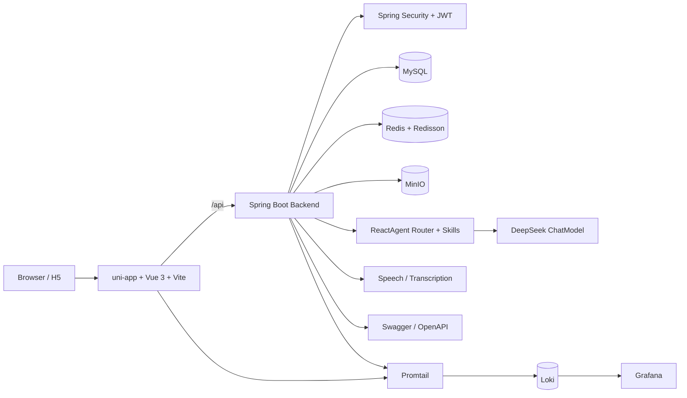
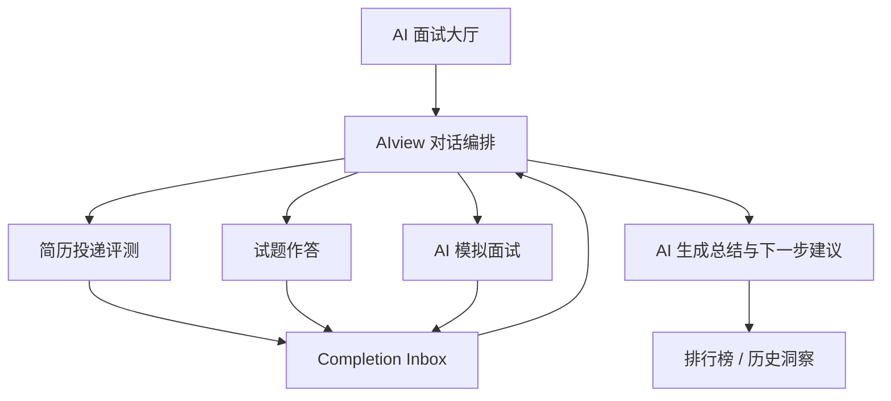

# Interview Agent

一个面向求职训练场景的 AI 面试平台，覆盖岗位选择、AIview 编排、简历投递评测、试题作答、AI 模拟面试、排行榜、聊天大厅和管理后台。当前仓库采用前后端分离架构：

- 前端：`uni-app + Vue 3 + Vite`
- 后端：`Spring Boot 3 + Spring Security + MyBatis`
- 存储与中间件：`MySQL + Redis + MinIO`
- AI 与多模态：`Spring AI Alibaba Agent Framework`、简历解析、语音合成、音频转写、场景评测

## 项目概览

### 当前已实现的业务模块

| 模块 | 能力说明 |
| --- | --- |
| 用户认证 | 注册、登录、找回密码、RSA 公钥获取 |
| 用户中心 | 昵称、头像、密码、邮箱、手机号、护眼模式、惊喜模式 |
| 岗位体系 | 岗位分类树、岗位列表、岗位详情、岗位分类管理、岗位职位管理 |
| AIview 流程 | AIview 编排、简历投递评测、试题作答、AI 模拟面试、多阶段通过标准 |
| 结果沉淀 | AIview 洞察、Agent 会话、分阶段排行榜 |
| 社区互动 | 聊天大厅、祝福墙、反馈 |
| 管理后台 | 用户列表、用户权限、岗位分类管理、岗位职位管理 |
| AI 会话 | Agent 会话持久化、消息记录、事件记录、压缩记忆 |

### 适用场景

- 求职者模拟面试与能力诊断
- 校招训练营、职业教育实训
- 企业内部培训或题库演示系统

## 系统架构



### 核心链路速览

| 链路 | 前端入口 | 后端入口 | 主要存储/依赖 |
| --- | --- | --- | --- |
| 登录认证 | `pages/login/index` | `/api/auth` | MySQL、JWT、RSA、BCrypt |
| AIview 对话 | `pages/ai-chat/index` | `/api/xunfei/getAgentAnswer` | ReactAgent、Skills、DeepSeek、Redis |
| 简历评测 | `pages/ai-resume/index` | `/api/resume/extract`、`/api/ai-assessment/resume` | PDFBox、Apache POI、MySQL |
| 试题作答 | `pages/ai-questions/index` | `/api/ai-assessment/question` | Skills、MySQL |
| AI 模拟面试 | `pages/ai-scenario/index` | `/api/ai-assessment/interview-round` | 讯飞转写、Skills、MySQL |
| 头像存储 | `pages/personal-center/index` | `/api/user/avatar/upload`、`/api/avatar` | MinIO |
| 日志排查 | Docker 容器日志 | `X-Trace-Id` | Promtail、Loki、Grafana |

### AIview 流程图



## 前端页面

当前 `project/src/pages.json` 中已注册的页面包括：

| 页面路径 | 页面作用 |
| --- | --- |
| `pages/landing/index` | 落地页 |
| `pages/login/index` | 登录 |
| `pages/register/index` | 注册 |
| `pages/home/index` | 首页 |
| `pages/job-selection/index` | 岗位选择 |
| `pages/ai-hall/index` | AI 面试大厅 |
| `pages/ai-chat/index` | AIview 对话编排页 |
| `pages/ai-resume/index` | 简历投递评测 |
| `pages/ai-questions/index` | 试题作答 |
| `pages/ai-scenario/index` | AI 模拟面试 |
| `pages/personal-center/index` | 个人中心 |
| `pages/chat-hall/index` | 聊天大厅 |
| `pages/leaderboard/index` | 排行榜 |
| `pages/admin/**` | 管理员中心、用户列表、权限管理、岗位分类管理、岗位职位管理 |

## 后端能力

当前后端控制器覆盖的接口域包括：

| 接口域 | 能力说明 |
| --- | --- |
| `/api/auth` | 登录、注册、找回密码、RSA 公钥 |
| `/api/user` | 用户资料与个人设置 |
| `/api/job-categories/*`、`/api/job*`、`/api/jobs*` | 岗位分类与岗位管理 |
| `/api/resume/extract` | 简历文件内容提取 |
| `/api/ai-assessment/*` | AIview 简历、试题、面试轮次评测记录 |
| `/api/aiview-insights/*` | AIview 近 7 天历史洞察 |
| `/api/xunfei/getAgentAnswer` | 统一 AI / Agent 调用入口 |
| `/api/agent-conversations/*` | Agent 会话持久化 |
| `/api/rank/aiview/*` | AIview 分阶段排行榜 |
| `/api/chat/*` | 聊天大厅消息 |
| `/api/blessings/*` | 祝福墙 |
| `/api/feedback/*` | 用户反馈 |
| `/api/speech/*`、`/api/transcription/*` | 语音合成与音频转写 |
| `/api/avatar` | 后端代理读取 MinIO 中的头像对象 |

另外，后端 `backend/src/main/resources/skills/` 下已经包含多个内置技能定义，例如：

| Skill | 作用 |
| --- | --- |
| `ai-interview-assistant` | AIview 对话编排和下一步建议 |
| `ai-resume-analysis` | 简历投递评测 |
| `ai-question-generation` | 试题生成 |
| `ai-question-scoring` | 试题评分 |
| `ai-question-analysis` | 题目解析 |
| `ai-round-question-generation` | 面试轮次题目生成 |
| `ai-round-evaluation` | 面试轮次回答评测 |

## 技术栈

### 前端

- `uni-app`
- `Vue 3`
- `Vite 5`
- `Pinia`
- `Element Plus`
- `Axios`
- `Chart.js`
- `ECharts`

### 后端

- `Spring Boot 3.4.x`
- `Spring Security`
- `MyBatis`
- `JWT`
- `Bucket4j`
- `Spring Retry`
- `Spring AI Alibaba Agent Framework`
- `Spring AI DeepSeek`
- `SpringDoc OpenAPI / Swagger UI`
- `Redisson`
- `MinIO Java SDK`

### 文档与文件处理

- `PDFBox`
- `Apache POI`

### 基础设施

- `MySQL`
- `Redis`
- `MinIO`
- `Docker Compose`
- `HTTPS` 本地证书
- `Maven Wrapper`

## 项目结构

```text
interview_agent/
├── backend/
│   ├── src/main/java/com/multimodal/interview/
│   │   ├── common/              # 统一返回、异常、安全过滤器、拦截器
│   │   ├── config/              # 安全、限流、模型、Web 配置
│   │   ├── controller/          # REST 接口
│   │   ├── dto/                 # 请求/响应 DTO
│   │   ├── entity/              # 数据实体
│   │   ├── mapper/              # MyBatis Mapper
│   │   ├── reactagent/          # Agent 路由、输出结构、记忆服务
│   │   ├── service/             # 业务服务接口
│   │   ├── service/impl/        # 业务服务实现
│   │   ├── util/                # 文件、图片、JSON 等工具类
│   │   └── InterviewAgentApplication.java
│   └── src/main/resources/
│       ├── application.yml      # 共享配置
│       ├── application-dev.yml  # 本地开发配置
│       ├── db/migration/        # Flyway 数据库迁移脚本
│       └── skills/              # 内置 Agent Skills
├── project/
│   ├── src/
│   │   ├── pages/               # 用户端与管理端页面
│   │   ├── components/          # 通用组件
│   │   ├── stores/              # 状态管理
│   │   ├── utils/               # 请求封装、接口常量、音频处理
│   │   ├── styles/              # 主题样式
│   │   └── static/              # 静态资源与展示图片
│   ├── vite.config.js           # Vite + HTTPS 配置
│   └── package.json
├── docker-compose.yml          # 本地容器编排
└── README.md
```

## 快速开始

### 环境要求

- `JDK 17+`
- `Node.js 18+`
- `MySQL 8+`
- `Redis 6+`
- `Maven 3.9+` 或直接使用项目自带 `./mvnw`

### 1. 克隆项目

```bash
git clone https://github.com/MenXiaoHuan/interview_agent.git
cd interview_agent
```

### 2. 初始化数据库

后端已接入 Flyway，启动时会自动执行按数据库类型隔离的迁移脚本：

```text
backend/src/main/resources/db/migration/mysql/V1__init_schema.sql
backend/src/main/resources/db/migration/h2/V1__init_schema.sql
```

默认数据库名为：

```text
interview_agent
```

### 3. 配置根目录 `.env`

根目录 `.env` 会被 Docker Compose 自动读取，也会通过 `env_file` 注入后端和前端容器。该文件包含真实密钥，已被 `.gitignore` 忽略，不应提交。

当前 `.env` 建议按以下分组维护：

```text
Backend - Runtime
Backend - Database
Backend - Redis
Backend - MinIO
Backend - Security
Backend - DeepSeek
Backend - Xunfei
Frontend - Runtime
```

当前默认关键项如下：

- 后端端口：`8442`
- 前端端口：`5172`
- MySQL：Compose 内部 `mysql:3306/interview_agent`，宿主机端口由 `PLATFORM_MYSQL_HOST_PORT` 控制
- Redis：Compose 内部 `redis:6379`
- MinIO：API 端口 `9000`，控制台端口 `9001`
- 头像存储：上传到 MinIO，数据库保存后端代理 URL `/api/avatar?object=...`
- AI：DeepSeek 与讯飞相关 Key 通过 `.env` 注入

后端仍保留以下配置文件：

```text
backend/src/main/resources/application.yml
backend/src/main/resources/application-dev.yml
```

### 4. Docker Compose 启动

推荐使用 Docker Compose 启动完整本地环境：

```bash
docker compose up --build
```

Compose 会启动：

- MySQL
- Redis
- MinIO
- Spring Boot 后端
- uni-app H5 前端

Docker 镜像与生产编排说明见 [`docs/docker.md`](docs/docker.md)。

默认访问地址：

- 前端：`https://localhost:5172`
- 后端：`https://localhost:8442`
- MinIO API：`http://localhost:9000`
- MinIO Console：`http://localhost:9001`

### 统一日志中心

项目通过 `Loki + Promtail + Grafana` 管理 Docker 容器日志。默认端口由根目录 `.env` 控制：

- Loki: `http://localhost:3100`
- Grafana: `http://localhost:3000`

后端响应会返回 `X-Trace-Id`，后端日志会包含 `traceId=`，可在 Grafana 中按 trace id 搜索单次请求链路。详细使用方式见 [docs/logging.md](docs/logging.md)。

### 5. 手动启动后端

如果不使用 Compose，需要自己准备 MySQL、Redis 和 MinIO，并确保 `.env` 中的主机名改成本机可访问地址，例如 `localhost`。

关键默认项：

- MySQL：`jdbc:mysql://localhost:3306/interview_agent`
- Redis：`localhost:6379`
- 后端端口：`8442`
- SSL：默认开启，证书 `classpath:springboot-local.p12`
- MinIO：`http://localhost:9000`
- AI：DeepSeek 与讯飞相关配置通过环境变量或本地 `.env` 注入

推荐优先通过环境变量覆盖这些配置，而不是直接提交敏感值。

```bash
cd backend
./mvnw spring-boot:run
```

默认地址：

- 服务地址：`https://localhost:8442`
- Swagger UI：`https://localhost:8442/swagger-ui/index.html`
- OpenAPI：`https://localhost:8442/v3/api-docs`

### 6. 手动启动前端

```bash
cd project
npm install
npm run dev:h5
```

默认地址：

- 前端地址：`https://localhost:5172`

### 7. 联调前务必检查端口

- 后端开发默认端口：`8442`
- 前端开发默认端口：`5172`
- 前端默认通过 Vite proxy 转发 `/api`、`/scenario`
- 如需连接其他后端地址，请在根目录 `.env` 中设置 `PLATFORM_WEB_API_PROXY_TARGET`

### 8. HTTPS 说明

- 前端 `vite.config.js` 已启用本地证书：`localhost+2.pem` 与 `localhost+2-key.pem`
- Compose 中后端端口和 SSL 开关由根目录 `.env` 注入，当前开发配置默认开启 SSL
- 手动启动后端时，`application-dev.yml` 默认开启 SSL，可通过 `PLATFORM_SSL_ENABLED=false` 覆盖
- 浏览器首次访问本地 HTTPS 服务时，可能需要手动信任证书

## 接口示例

下面给出几组和当前代码一致的接口示例。

### 1. 获取 RSA 公钥

```bash
curl -k https://localhost:8442/api/auth/rsa-public-key
```

说明：

- 登录、注册、重置密码前，前端会先调用该接口获取 RSA 公钥
- `project/src/utils/api/request.js` 中已实现敏感密码字段的前端 RSA 加密

### 2. 获取岗位分类树

```bash
curl -k https://localhost:8442/api/job-categories/tree
```

### 3. 获取岗位列表

```bash
curl -k "https://localhost:8442/api/job?categoryId=2"
```

### 4. 调用统一 Agent 接口

```bash
curl -k -X POST https://localhost:8442/api/xunfei/getAgentAnswer \
  -H "Content-Type: application/json" \
  -H "Authorization: Bearer <your-jwt-token>" \
  -d '{
    "agentKey": "ai-interview-assistant",
    "chatId": "demo-chat-001",
    "params": {
      "message": "帮我开始一轮前端工程师模拟面试",
      "targetJobHint": "前端工程师"
    }
  }'
```

### 5. 保存 Agent 会话

```bash
curl -k -X POST https://localhost:8442/api/agent-conversations/session \
  -H "Content-Type: application/json" \
  -H "Authorization: Bearer <your-jwt-token>" \
  -d '{
    "agentKey": "ai-interview-assistant",
    "chatId": "demo-chat-001",
    "title": "前端模拟面试",
    "preview": "我们先做一轮自我介绍"
  }'
```

### 6. 简历内容提取

```bash
curl -k -X POST https://localhost:8442/api/resume/extract \
  -H "Authorization: Bearer <your-jwt-token>" \
  -F "file=@/path/to/resume.pdf"
```

### 7. 上传头像到 MinIO

```bash
curl -k -X POST https://localhost:8442/api/user/avatar/upload \
  -H "Authorization: Bearer <your-jwt-token>" \
  -F "file=@/path/to/avatar.png"
```

说明：

- 后端会上传文件到 MinIO
- 数据库保存后端代理 URL，例如 `/api/avatar?object=avatar%2Fuser-1%2Fxxx.png`
- 前端展示头像时访问该代理 URL，由后端读取 MinIO 并返回图片流

## 部署说明

### 本地开发部署

1. 准备 MySQL、Redis
2. 确认 Flyway 迁移脚本可连接目标数据库执行
3. 配置根目录 `.env`
4. 确认前端代理目标与后端端口一致
5. 启动后端
6. 启动前端
7. 浏览器信任本地 HTTPS 证书

也可以使用 Docker Compose 启动 MySQL、Redis、MinIO、后端与前端：

```bash
docker compose up --build
```

生产镜像和生产 Compose 说明见 [`docs/docker.md`](docs/docker.md)。

### 服务器部署建议

#### 后端

- 使用环境变量覆盖数据库、Redis、JWT、AI Key、证书路径等配置
- 通过 `java -jar` 启动，或使用 `docker-compose.prod.yml` 构建生产镜像
- 建议在 `systemd`、`supervisor` 或容器平台中托管进程

示例：

```bash
cd backend
./mvnw clean package -DskipTests
java -jar target/interview-agent-java-0.0.1-SNAPSHOT.jar
```

#### 前端

- 先执行构建
- 将构建产物部署到静态服务器或 Nginx
- 若只运行 H5，可将接口地址切到正式后端域名
- 也可以使用 `project/Dockerfile` 构建 nginx 静态资源镜像

示例：

```bash
cd project
npm install
npm run build:h5
```

#### 反向代理建议

- 由 Nginx 统一处理 HTTPS 证书与域名
- `/api/` 反代到 Spring Boot 服务
- `/api/avatar` 通过 `/api/` 反代到 Spring Boot 服务，由后端代理读取 MinIO 头像
- 前端静态资源由 Nginx 直接托管

## 开发注意事项

- 前端开发默认使用 Vite proxy 访问后端，不再写死 `https://localhost:8442`
- 后端很多接口需要 JWT，未认证会返回 `401`
- 登录、注册、重置密码依赖前端 RSA 加密流程
- 若后端无法启动，优先检查端口、数据库、Redis、MinIO、SSL 证书和第三方 AI 配置
- 若前端 HTTPS 打不开，优先检查 `project/localhost+2.pem` 与 `localhost+2-key.pem`
- 若头像上传报错，检查 MinIO 服务、bucket、access key、secret key 和 `PLATFORM_MINIO_INTERNAL_ENDPOINT`

## 后续可完善项

- 补充正式环境 Nginx 配置模板
- 增加更完整的接口文档和业务演示视频

## License

本项目使用 MIT License，详见 [`LICENSE`](LICENSE)。
