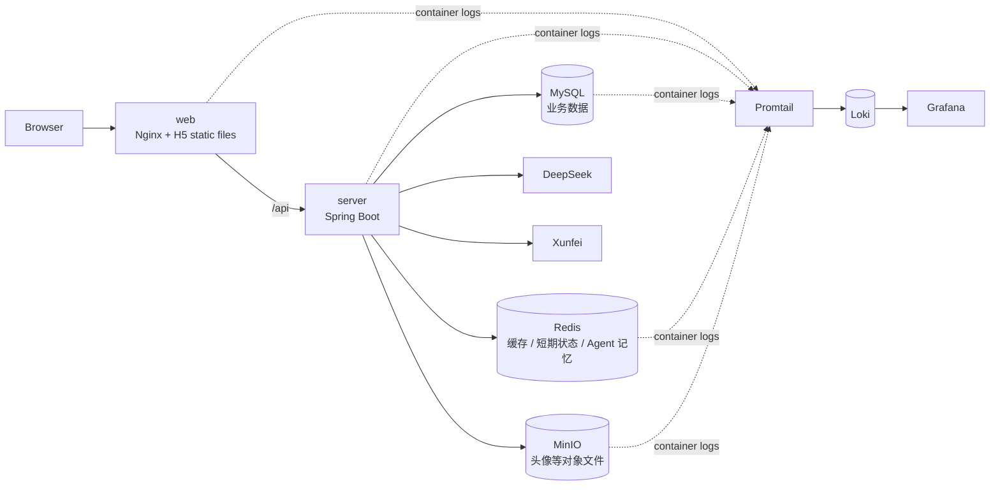
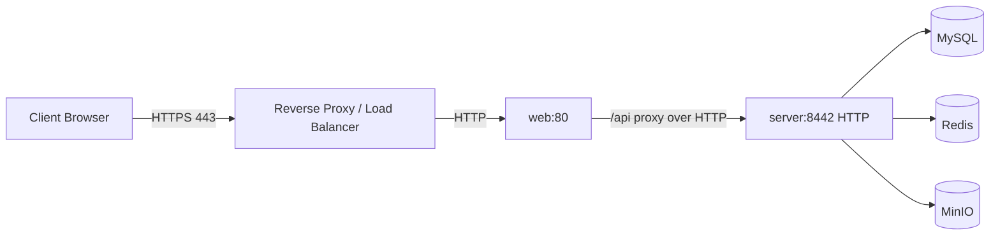

# 部署指南

本文档说明如何将 `Interview Agent` 从代码仓库部署到服务器，并完成启动、验证、备份和故障排查。

## 部署架构

生产部署使用 `docker-compose.prod.yml` 编排服务：



服务职责：

| 服务 | 作用 | 默认端口变量 |
| --- | --- | --- |
| `web` | 前端生产容器，Nginx 托管 H5 静态资源 | `PLATFORM_WEB_HOST_PORT` |
| `server` | 后端 Spring Boot API 服务，仅在 Compose 网络内供 `web` 访问 | 不直接发布宿主机端口 |
| `mysql` | MySQL 业务数据库 | `PLATFORM_MYSQL_HOST_PORT` |
| `redis` | Redis 缓存与短期状态 | `PLATFORM_REDIS_HOST_PORT` |
| `minio` | 对象存储，保存头像等文件 | `PLATFORM_MINIO_API_HOST_PORT` / `PLATFORM_MINIO_CONSOLE_HOST_PORT` |
| `loki` | 日志存储与查询 API | `PLATFORM_LOKI_HOST_PORT` |
| `promtail` | Docker 容器日志采集 | 不对外暴露 |
| `grafana` | 日志查询 UI | `PLATFORM_GRAFANA_HOST_PORT` |

## 服务器准备

建议服务器满足：

- `Linux x86_64`，推荐 Ubuntu 22.04 LTS 或同类发行版。
- `2 CPU / 4 GB RAM` 起步；AI 调用量、日志量较高时建议更高配置。
- 磁盘建议 `40 GB+`，并预留 MySQL、MinIO、Loki 日志增长空间。
- 已安装 `Git`、`Docker Engine`、`Docker Compose Plugin`。
- 防火墙按需开放前端、后端、MinIO、Grafana 等端口。

生产环境通常只建议直接开放前端入口端口，MySQL、Redis、Loki 不建议暴露公网。MinIO Console 和 Grafana 如需公网访问，建议放在 VPN、内网或反向代理鉴权之后。

检查 Docker：

```bash
docker --version
docker compose version
```

如果没有 Docker，请先按官方文档安装 Docker Engine 和 Compose Plugin。

## 获取代码

```bash
git clone https://github.com/MenXiaoHuan/interview_agent.git
cd interview_agent
```

后续更新代码：

```bash
git pull origin main
```

## 准备环境变量

根目录 `.env` 是部署配置中心，包含端口、数据库、Redis、MinIO、JWT、AI key、日志中心等配置。

不要提交 `.env` 到 Git。

如果服务器上还没有 `.env`，可以按下面结构创建：

```env
# Backend - Runtime
SPRING_PROFILES_ACTIVE=dev
PLATFORM_SERVER_HOST_PORT=8442
PLATFORM_CORS_ALLOWED_ORIGINS=https://your-domain.example
PLATFORM_SWAGGER_ENABLED=false

# Backend - Database
PLATFORM_DB_NAME=interview_agent
PLATFORM_DB_URL=jdbc:mysql://mysql:3306/interview_agent?useSSL=false&allowPublicKeyRetrieval=true&createDatabaseIfNotExist=true&serverTimezone=UTC
PLATFORM_DB_USERNAME=root
PLATFORM_DB_PASSWORD=change-me
PLATFORM_MYSQL_HOST_PORT=3306

# Backend - Redis
PLATFORM_REDIS_HOST=redis
PLATFORM_REDIS_PORT=6379
PLATFORM_REDIS_HOST_PORT=6379
PLATFORM_REDIS_PASSWORD=change-me
PLATFORM_REDIS_DATABASE=0

# Backend - MinIO
PLATFORM_MINIO_ENDPOINT=http://minio:9000
PLATFORM_MINIO_INTERNAL_ENDPOINT=http://minio:9000
PLATFORM_MINIO_API_HOST_PORT=9000
PLATFORM_MINIO_CONSOLE_HOST_PORT=9001
PLATFORM_MINIO_ACCESS_KEY=change-me
PLATFORM_MINIO_SECRET_KEY=change-me
PLATFORM_STORAGE_BUCKET=interview-agent

# Backend - Security
PLATFORM_JWT_SECRET=change-me-at-least-32-bytes

# Backend - DeepSeek
PLATFORM_DEEPSEEK_API_KEY=change-me
PLATFORM_DEEPSEEK_BASE_URL=https://api.deepseek.com
PLATFORM_DEEPSEEK_MODEL=deepseek-chat
PLATFORM_DEEPSEEK_TEMPERATURE=0.6

# Backend - Xunfei
PLATFORM_XUNFEI_APPID=change-me
PLATFORM_XUNFEI_API_KEY=change-me
PLATFORM_XUNFEI_API_SECRET=change-me
PLATFORM_XUNFEI_OST_APP_ID=change-me
PLATFORM_XUNFEI_OST_API_KEY=change-me
PLATFORM_XUNFEI_OST_API_SECRET=change-me

# Frontend - Runtime
PLATFORM_WEB_HOST_PORT=5172
PLATFORM_WEB_API_PROXY_TARGET=http://server:8442

# Backend - Logging
PLATFORM_LOKI_HOST_PORT=3100
PLATFORM_GRAFANA_HOST_PORT=3000
PLATFORM_GRAFANA_ADMIN_USER=admin
PLATFORM_GRAFANA_ADMIN_PASSWORD=change-me
```

当前仓库只保留 `application.yml` 和 `application-dev.yml`，生产 Compose 暂沿用 `SPRING_PROFILES_ACTIVE=dev`，但实际数据库、Redis、MinIO、JWT、AI key 等关键配置都由 `.env` 注入。后续如果需要更严格的正式环境隔离，可以新增独立 profile，或继续保持完全环境变量化配置。

生产环境建议：

- 修改所有 `change-me`。
- `PLATFORM_SWAGGER_ENABLED=false`，避免公开 Swagger。
- `PLATFORM_GRAFANA_ADMIN_PASSWORD` 使用强密码。
- `PLATFORM_JWT_SECRET` 使用至少 32 字节的随机字符串。
- DeepSeek、Xunfei、MinIO、Redis、MySQL 密码不要复用。
- 如果 `.env` 中包含 `$`，用于 Docker Compose 插值时可能需要写成 `$$`。

## 生产启动

启动前先检查 Compose 配置是否能正确解析 `.env`：

```bash
docker compose -f docker-compose.prod.yml config --quiet
```

构建并启动全部生产服务：

```bash
docker compose -f docker-compose.prod.yml up -d --build
```

查看服务状态：

```bash
docker compose -f docker-compose.prod.yml ps
```

查看后端日志：

```bash
docker compose -f docker-compose.prod.yml logs -f server
```

查看前端日志：

```bash
docker compose -f docker-compose.prod.yml logs -f web
```

停止服务：

```bash
docker compose -f docker-compose.prod.yml down
```

不要随意执行：

```bash
docker compose -f docker-compose.prod.yml down -v
```

`-v` 会删除命名卷，可能导致 MySQL、Redis、MinIO、Loki、Grafana 数据丢失。

## 数据持久化

`docker-compose.prod.yml` 使用命名卷保存运行数据：

| 卷 | 挂载位置 | 保存内容 |
| --- | --- | --- |
| `mysql-data` | `/var/lib/mysql` | MySQL 表结构和业务数据 |
| `redis-data` | `/data` | Redis AOF 持久化文件 |
| `minio-data` | `/data` | MinIO 对象文件 |
| `loki-data` | `/loki` | Loki 日志数据 |
| `grafana-data` | `/var/lib/grafana` | Grafana 配置、状态、面板 |

查看卷：

```bash
docker volume ls | grep interview_agent
```

查看 MySQL 卷详情：

```bash
docker volume inspect interview_agent_mysql-data
```

普通重启、停止、重新创建容器不会默认删除这些卷。删除卷或执行 `down -v` 才会清理数据。

## 数据库备份

建议定期备份 MySQL。先进入项目根目录，再执行：

```bash
mkdir -p backups/mysql

MYSQL_PASSWORD=$(grep '^PLATFORM_DB_PASSWORD=' .env | cut -d= -f2-)
MYSQL_DATABASE=$(grep '^PLATFORM_DB_NAME=' .env | cut -d= -f2-)

docker compose -f docker-compose.prod.yml exec -T mysql mysqldump \
  -uroot \
  -p"$MYSQL_PASSWORD" \
  --databases "$MYSQL_DATABASE" \
  --single-transaction \
  --routines \
  --triggers \
  --events \
  > backups/mysql/${MYSQL_DATABASE}-$(date +%Y%m%d-%H%M%S).sql
```

恢复备份：

```bash
MYSQL_PASSWORD=$(grep '^PLATFORM_DB_PASSWORD=' .env | cut -d= -f2-)

docker compose -f docker-compose.prod.yml exec -T mysql mysql \
  -uroot \
  -p"$MYSQL_PASSWORD" \
  < backups/mysql/interview_agent-20260625-193000.sql
```

定期备份可以使用 `cron`：

```cron
0 2 * * * cd /path/to/interview_agent && mkdir -p backups/mysql && MYSQL_PASSWORD=$(grep '^PLATFORM_DB_PASSWORD=' .env | cut -d= -f2-) && MYSQL_DATABASE=$(grep '^PLATFORM_DB_NAME=' .env | cut -d= -f2-) && docker compose -f docker-compose.prod.yml exec -T mysql mysqldump -uroot -p"$MYSQL_PASSWORD" --databases "$MYSQL_DATABASE" --single-transaction --routines --triggers --events > backups/mysql/${MYSQL_DATABASE}-$(date +\%Y\%m\%d-\%H\%M\%S).sql && find backups/mysql -name '*.sql' -mtime +14 -delete
```

## 上线验证

普通 shell 不会自动读取 `.env`。不要直接 `source .env`，因为 `.env` 中的 `$`、`!` 等特殊字符可能被 shell 展开。验证命令建议只按需读取端口变量：

```bash
WEB_PORT=$(grep '^PLATFORM_WEB_HOST_PORT=' .env | cut -d= -f2-)
SERVER_PORT=$(grep '^PLATFORM_SERVER_HOST_PORT=' .env | cut -d= -f2-)
MINIO_API_PORT=$(grep '^PLATFORM_MINIO_API_HOST_PORT=' .env | cut -d= -f2-)
LOKI_PORT=$(grep '^PLATFORM_LOKI_HOST_PORT=' .env | cut -d= -f2-)
GRAFANA_PORT=$(grep '^PLATFORM_GRAFANA_HOST_PORT=' .env | cut -d= -f2-)
```

启动后先确认容器状态：

```bash
docker compose -f docker-compose.prod.yml ps
```

验证前端：

```bash
curl -I http://localhost:${WEB_PORT}
```

生产 `web` 容器默认是 Nginx HTTP 服务，Compose 将宿主机 `PLATFORM_WEB_HOST_PORT` 映射到容器 `80`。如果前面接入了 HTTPS 反向代理或负载均衡，再用公网 HTTPS 域名验证：

```bash
curl -I https://your-domain.example
```

验证后端：

```bash
curl -k -i https://localhost:${SERVER_PORT}/api/auth/rsa-public-key
```

期望：

- HTTP 状态码为 `200`。
- 响应头包含 `X-Trace-Id`。

验证前端代理：

```bash
curl -i http://localhost:${WEB_PORT}/api/auth/rsa-public-key
```

验证 MySQL：

```bash
MYSQL_PASSWORD=$(grep '^PLATFORM_DB_PASSWORD=' .env | cut -d= -f2-)

docker compose -f docker-compose.prod.yml exec -T mysql mysql \
  -uroot \
  -p"$MYSQL_PASSWORD" \
  -e "SHOW DATABASES;"
```

验证 Redis：

```bash
REDIS_PASSWORD=$(grep '^PLATFORM_REDIS_PASSWORD=' .env | cut -d= -f2-)

docker compose -f docker-compose.prod.yml exec -T redis redis-cli \
  -a "$REDIS_PASSWORD" \
  ping
```

期望返回：

```text
PONG
```

验证 Redis AOF：

```bash
REDIS_PASSWORD=$(grep '^PLATFORM_REDIS_PASSWORD=' .env | cut -d= -f2-)

docker compose -f docker-compose.prod.yml exec -T redis redis-cli \
  -a "$REDIS_PASSWORD" \
  config get appendonly
```

期望包含：

```text
appendonly
yes
```

验证 MinIO：

```bash
curl -f http://localhost:${MINIO_API_PORT}/minio/health/live
```

验证 Loki：

```bash
curl -f http://localhost:${LOKI_PORT}/ready
```

验证 Grafana：

```bash
curl -I http://localhost:${GRAFANA_PORT}/login
```

## 日志排查

查看容器日志：

```bash
docker compose -f docker-compose.prod.yml logs -f server
docker compose -f docker-compose.prod.yml logs -f web
docker compose -f docker-compose.prod.yml logs -f mysql
docker compose -f docker-compose.prod.yml logs -f redis
docker compose -f docker-compose.prod.yml logs -f minio
```

访问 Grafana：

```text
http://localhost:${PLATFORM_GRAFANA_HOST_PORT}
```

常用 LogQL：

```logql
{container_name=~".*server.*"}
{container_name=~".*server.*"} |= "ERROR"
{container_name=~".*server.*"} |= "traceId=<value>"
{container_name=~".*web.*"}
{container_name=~".*mysql.*"}
{container_name=~".*redis.*"}
{container_name=~".*minio.*"}
```

排查一次请求：

1. 用浏览器或 `curl` 调接口。
2. 从响应头复制 `X-Trace-Id`。
3. 到 Grafana 查询：

```logql
{container_name=~".*server.*"} |= "traceId=<copied-trace-id>"
```

## 公网 HTTPS 与反向代理

生产环境推荐把公网 HTTPS 放在统一入口层，例如外部 Nginx、Caddy、云负载均衡或 Ingress。这样前端生产容器仍然只监听 HTTP `80`，公网入口负责证书、TLS 终止和域名转发。



推荐做法：

- 公网只开放 `443` 和必要的 `80` 跳转端口。
- `server` 默认只在 Compose 网络内访问；`mysql`、`redis`、`loki` 也建议只对受控网络开放。
- Grafana 和 MinIO Console 如需公网访问，应额外加访问控制。
- 后端容器默认使用 HTTP，前端 Nginx 代理到 `http://server:8442`；公网 HTTPS 证书集中放在外层 Nginx、Caddy、云负载均衡或 Ingress。

## 常见故障

### 端口被占用

查看端口占用：

```bash
lsof -i :8442
lsof -i :5172
lsof -i :3306
```

处理方式：

- 停止占用端口的旧进程。
- 或修改 `.env` 中对应的 `*_HOST_PORT`。

### 后端连接不上 MySQL

检查：

- `.env` 中 `PLATFORM_DB_URL` 是否使用 Compose 服务名 `mysql`。
- `PLATFORM_DB_PASSWORD` 是否和 MySQL root 密码一致。
- `mysql` 容器是否启动。

命令：

```bash
docker compose -f docker-compose.prod.yml ps mysql
docker compose -f docker-compose.prod.yml logs --tail=100 mysql
```

### 后端连接不上 Redis

检查：

- `.env` 中 `PLATFORM_REDIS_HOST=redis`。
- `PLATFORM_REDIS_PASSWORD` 是否和 Redis 启动命令一致。
- Redis 容器是否启动。

命令：

```bash
docker compose -f docker-compose.prod.yml ps redis
docker compose -f docker-compose.prod.yml logs --tail=100 redis
```

### 头像上传失败

检查：

- MinIO 容器是否启动。
- `.env` 中 MinIO access key、secret key 是否正确。
- `PLATFORM_STORAGE_BUCKET=interview-agent`。
- 后端日志中是否有 MinIO 连接或 bucket 创建错误。

命令：

```bash
docker compose -f docker-compose.prod.yml ps minio
docker compose -f docker-compose.prod.yml logs --tail=100 server
```

### 前端请求后端失败

检查：

- `PLATFORM_WEB_API_PROXY_TARGET` 是否为容器内可访问地址，例如 `http://server:8442`。
- 后端是否以 HTTP 方式监听 `PLATFORM_SERVER_HOST_PORT`。
- 前端生产 Nginx 是否正确代理 `/api`。
- 外层 HTTPS 网关是否正确转发到 `web` 容器端口。

命令：

```bash
docker compose -f docker-compose.prod.yml logs --tail=100 web
docker compose -f docker-compose.prod.yml logs --tail=100 server
```

### Grafana 看不到日志

检查：

- `promtail` 是否运行。
- `loki` 是否 ready。
- Promtail 是否能读取 Docker 日志路径和 Docker socket。

命令：

```bash
docker compose -f docker-compose.prod.yml ps promtail loki grafana
docker compose -f docker-compose.prod.yml logs --tail=100 promtail
curl http://localhost:${PLATFORM_LOKI_HOST_PORT}/ready
```

### CI 失败

检查：

- 后端测试是否依赖 Redis，CI 中应有 Redis service。
- 前端是否通过 `npm ci`、`npm run lint`、`npm test`、`npm run build:h5`。
- 是否误提交了 `sk-...` API key 或 JWT secret。

本地复现：

```bash
cd backend
./mvnw test

cd ../project
npm ci
npm run lint
npm test
npm run build:h5
```

## 安全建议

- `.env` 不提交 Git，不贴到公开 issue、PR、日志或截图里。
- 生产环境修改 MySQL、Redis、MinIO、Grafana 默认密码。
- 生产环境关闭 Swagger 或限制访问。
- 生产环境使用正式域名和可信 HTTPS 证书。
- 不把 MinIO bucket 设置为公共读，头像通过后端 `/api/avatar` 代理读取。
- 定期备份 MySQL，重要 MinIO 数据也应考虑对象存储备份。
- 定期轮换 DeepSeek、Xunfei、MinIO、JWT 等密钥。
- Grafana 不建议暴露到公网；如需公网访问，应加反向代理、HTTPS、强密码和访问控制。

## 更新发布流程

推荐流程：

```bash
git pull origin main
docker compose -f docker-compose.prod.yml config --quiet
docker compose -f docker-compose.prod.yml up -d --build
docker compose -f docker-compose.prod.yml ps
```

发布后验证：

```bash
WEB_PORT=$(grep '^PLATFORM_WEB_HOST_PORT=' .env | cut -d= -f2-)
SERVER_PORT=$(grep '^PLATFORM_SERVER_HOST_PORT=' .env | cut -d= -f2-)
GRAFANA_PORT=$(grep '^PLATFORM_GRAFANA_HOST_PORT=' .env | cut -d= -f2-)
LOKI_PORT=$(grep '^PLATFORM_LOKI_HOST_PORT=' .env | cut -d= -f2-)

curl -k -i https://localhost:${SERVER_PORT}/api/auth/rsa-public-key
curl -i http://localhost:${WEB_PORT}/api/auth/rsa-public-key
curl -I http://localhost:${GRAFANA_PORT}/login
curl -f http://localhost:${LOKI_PORT}/ready
```

如需临时回滚代码：

```bash
git log --oneline -5
git checkout <previous-commit>
docker compose -f docker-compose.prod.yml up -d --build
```

`git checkout <previous-commit>` 会进入 detached HEAD，适合临时回滚验证。更规范的发布方式是给稳定版本打 tag，例如 `v1.0.0`，回滚时切到明确的 tag。回滚前建议先备份数据库。
