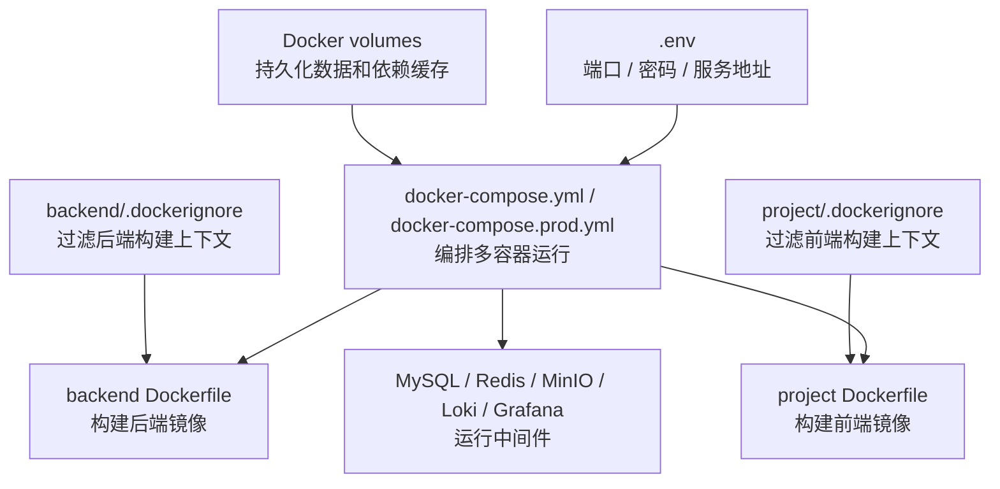
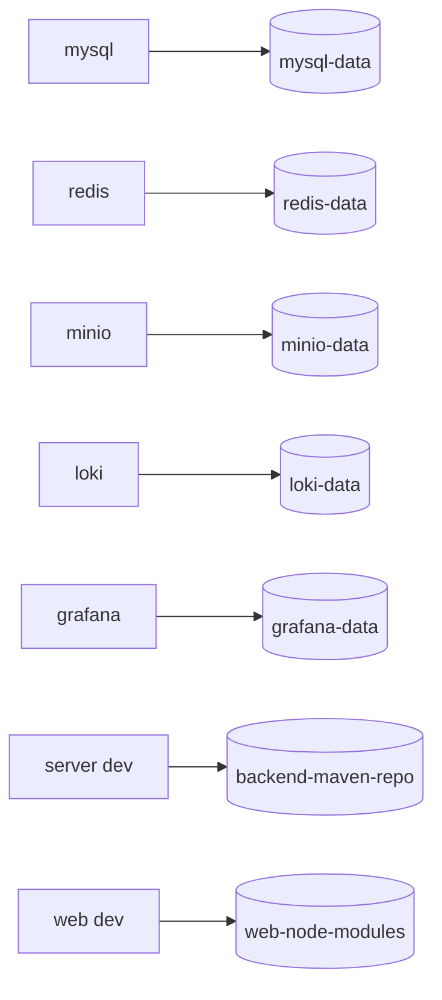

# Docker 镜像与 Compose 说明

本文说明本项目 Dockerfile、Dockerfile.dev、.dockerignore 与 Compose 的职责划分。

## 职责关系



简单理解：

- Dockerfile 负责“一个服务如何构建镜像”。
- Docker Compose 负责“多个服务如何一起运行”。
- `.dockerignore` 负责“哪些文件不要进入镜像构建上下文”。
- `.env` 负责“运行时变量从哪里来”。
- volumes 负责“容器重建后哪些数据要保留”。

## 文件职责

- `backend/Dockerfile.dev`：后端本地开发镜像，默认执行 `./mvnw spring-boot:run`。
- `backend/Dockerfile`：后端生产镜像，多阶段构建 jar，最终只运行 `java -jar /app/app.jar`。
- `backend/.dockerignore`：过滤 `target/`、日志、IDE 配置、临时文件和本地环境变量。
- `project/Dockerfile.dev`：前端本地开发镜像，默认执行 `npm run dev:h5`。
- `project/Dockerfile`：前端生产镜像，多阶段构建 H5 静态资源，最终用 nginx 托管。
- `project/.dockerignore`：过滤 `node_modules/`、`dist/`、缓存、日志和本地环境变量。
- `docker-compose.yml`：默认本地开发编排，使用前后端 `Dockerfile.dev`。
- `docker-compose.prod.yml`：生产编排，使用前后端 `Dockerfile`。

## 环境变量

Compose 会自动读取项目根目录 `.env` 做变量插值，并通过 `env_file` 注入前后端容器。

关键变量：

- `PLATFORM_SERVER_HOST_PORT`：后端宿主机端口，默认当前为 `8442`。
- `PLATFORM_WEB_HOST_PORT`：前端宿主机端口，默认当前为 `5172`。
- `PLATFORM_WEB_API_PROXY_TARGET`：前端代理后端地址，Compose 内推荐为 `http://server:8442`。
- `PLATFORM_DB_URL`：Compose 内推荐使用 `jdbc:mysql://mysql:3306/interview_agent?...`。
- `PLATFORM_REDIS_HOST`：Compose 内推荐使用 `redis`。
- `PLATFORM_MINIO_INTERNAL_ENDPOINT`：Compose 内推荐使用 `http://minio:9000`。

## 本地开发启动

```bash
docker compose up --build
```

开发编排特点：

- 后端源码挂载到 `/app`，使用 Maven wrapper 启动。
- 前端源码挂载到 `/app`，使用 Vite/uni-app 开发服务启动。
- Maven 依赖缓存保存在 `backend-maven-repo` volume。
- 前端依赖保存在 `web-node-modules` volume。

访问地址：

- 前端：`https://localhost:${PLATFORM_WEB_HOST_PORT}`
- 后端：`http://localhost:${PLATFORM_SERVER_HOST_PORT}`
- MinIO Console：`http://localhost:${PLATFORM_MINIO_CONSOLE_HOST_PORT}`

本地开发的 `web` 服务由 Vite/uni-app dev server 提供，当前前端默认启用 HTTPS，后端默认使用 HTTP，Vite 代理负责把 `/api` 转发到后端容器。

## 生产镜像启动

```bash
docker compose -f docker-compose.prod.yml up --build -d
```

生产编排特点：

- 后端镜像在构建阶段执行 Maven package，运行阶段只保留 JRE 和 jar。
- 前端镜像在构建阶段执行 `npm run build:h5`，运行阶段使用 nginx 托管 H5 静态资源。
- 生产编排不挂载前后端源码。
- nginx 会把 `/api`、`/scenario` 代理到 `PLATFORM_WEB_API_PROXY_TARGET`，当前默认目标是 `http://server:8442`，头像读取接口统一走 `/api/avatar`。
- 生产 `server` 不发布宿主机端口，只在 Compose 网络内由 `web` 访问，避免后端直接暴露到公网。

生产 `web` 容器内部监听 HTTP `80`，Compose 将宿主机 `PLATFORM_WEB_HOST_PORT` 映射到容器 `80`。如果需要公网 HTTPS，建议在 Compose 外层使用 Nginx、Caddy、云负载均衡或 Ingress 做 TLS 终止。

`project/nginx.conf.template` 是前端生产容器的 Nginx 配置模板。官方 `nginx` 镜像启动时会读取 `/etc/nginx/templates/*.template`，把其中的环境变量（例如 `${PLATFORM_WEB_API_PROXY_TARGET}`）替换成容器运行时的真实值，再生成最终 Nginx 配置。因此它叫 `template`，作用是让同一个镜像可以在不同环境代理到不同后端地址。

## 数据卷



- `mysql-data`：保存 MySQL 业务数据。
- `redis-data`：保存 Redis AOF 持久化文件。
- `minio-data`：保存头像等对象文件。
- `loki-data`：保存日志数据。
- `grafana-data`：保存 Grafana 状态。
- `backend-maven-repo`：开发环境 Maven 依赖缓存。
- `web-node-modules`：开发环境前端依赖缓存。

## 停止服务

```bash
docker compose down
```

生产编排停止：

```bash
docker compose -f docker-compose.prod.yml down
```

如需同时清理数据卷：

```bash
docker compose down -v
docker compose -f docker-compose.prod.yml down -v
```

## 常见问题

- 如果端口被占用，先停止占用端口的旧进程，或调整根目录 `.env` 中的端口变量。
- 如果前端请求后端失败，检查 `PLATFORM_WEB_API_PROXY_TARGET` 是否为容器内可访问地址，例如 `http://server:8442`。
- 如果后端无法连接 MySQL/Redis/MinIO，检查 `.env` 中服务地址是否使用 Compose 服务名：`mysql`、`redis`、`minio`。
- 如果前端 HTTPS 证书是本地自签名证书，浏览器首次访问可能需要手动信任。
