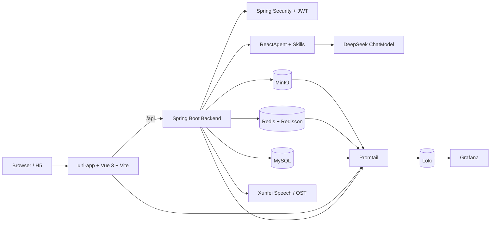
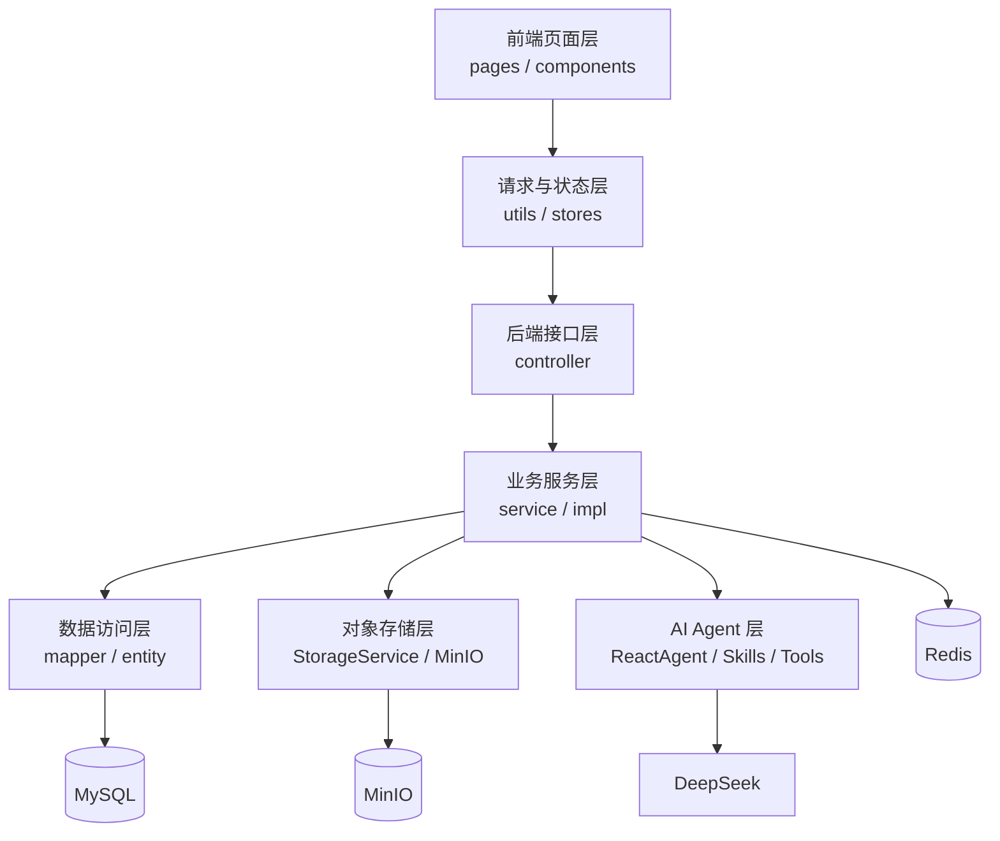

# Interview Agent 项目架构与技术说明

这份文档用于说明 `Interview Agent` 的项目架构、技术选型、核心链路、部署方式和关键文件职责。重点不是罗列文件名，而是讲清楚项目解决什么问题、为什么这样设计、核心链路如何运行。

## 一句话介绍

`Interview Agent` 是一个面向求职训练场景的 AI 面试平台，采用前后端分离架构，前端负责岗位选择、AIview 编排、测评执行和结果展示，后端负责认证鉴权、岗位/评测/会话数据管理、AI Agent 编排、文件对象存储、数据库迁移、日志追踪和容器化部署。

## 项目亮点

- **业务完整**：覆盖注册登录、岗位选择、AIview 编排、简历投递评测、试题作答、AI 模拟面试、排行榜、聊天大厅和管理后台。
- **架构清晰**：前端 `uni-app + Vue 3 + Vite`，后端 `Spring Boot 3 + Spring Security + MyBatis`，基础设施使用 `MySQL + Redis + MinIO`。
- **AI 能力工程化**：通过 `Spring AI Alibaba Agent Framework` 和内置 `skills/` 将不同 AI 能力拆成多个业务 Agent，并用结构化输出约束模型结果。
- **安全意识**：登录密码前端 RSA 加密，后端使用 BCrypt 存储密码、JWT 做无状态认证、Spring Security 统一鉴权。
- **可运维**：Docker Compose 编排前后端和中间件，统一 `.env` 管理环境变量，接入 `Loki + Promtail + Grafana` 日志中心。
- **质量保障**：后端 JUnit/Mockito 测试，前端 Vitest/ESLint/Build，GitHub Actions 自动跑 CI 和敏感信息扫描。

## 技术架构总览



项目整体是前后端分离架构。前端通过 Vite 代理或同源地址访问 `/api`，后端统一以 Spring Boot REST API 提供服务。业务数据进入 MySQL，短期状态和 Agent 记忆使用 Redis，头像等对象文件进入 MinIO。AI 能力不是直接写死在一个接口里，而是通过多个 ReactAgent 和 skills 拆分业务能力。部署上使用 Docker Compose 把 MySQL、Redis、MinIO、后端、前端和日志中心一起编排起来。

## 分层结构



## 前端架构

### 前端技术选型

- `uni-app`：支持 H5 和多端扩展，当前主要用于 H5 页面。
- `Vue 3`：组件化开发页面和交互。
- `Vite`：本地开发、HTTPS dev server、H5 构建。
- `Pinia`：管理用户和岗位等全局状态。
- `Axios`：统一请求封装。
- `Element Plus / uni-ui`：用于管理端和部分通用 UI。
- `Vitest + jsdom`：前端单元测试。
- `ESLint + Prettier`：代码质量和格式化。

### 前端目录职责

| 路径 | 作用 | 技术说明 |
| --- | --- | --- |
| `project/src/main.js` | 前端入口 | 创建 Vue 应用，挂载 Pinia 等插件 |
| `project/src/App.vue` | 应用根组件 | 全局页面容器 |
| `project/src/pages.json` | uni-app 路由配置 | 注册所有页面路径、导航栏、页面样式 |
| `project/src/pages/` | 页面目录 | 每个业务页面一个目录，例如登录、首页、岗位选择、AI 面试、管理后台 |
| `project/src/components/` | 通用组件 | 抽出选择器、弹窗、图表、图标等复用 UI |
| `project/src/stores/` | Pinia 状态 | 保存用户、岗位等跨页面状态 |
| `project/src/utils/api/request.js` | 请求封装 | Axios 实例、JWT 注入、错误处理、敏感密码 RSA 加密 |
| `project/src/utils/api/api-config.js` | API 地址配置 | 优先读环境变量和运行时地址，否则默认同源，方便 Docker/Vite 代理 |
| `project/src/utils/api/pages/` | 页面维度 API | 按页面拆分接口模块，避免全局 API 文件膨胀 |
| `project/src/utils/storage.js` | 本地存储封装 | 统一 token、用户信息等 localStorage/sessionStorage 操作 |
| `project/src/utils/avatar.js` | 头像工具 | 处理头像上传、展示地址等逻辑 |
| `project/src/utils/audio-processor.js` | 音频处理 | 支撑语音评测、转写等多媒体场景 |
| `project/src/static/` | 静态资源 | 页面素材、图标、展示图片 |
| `project/vite.config.js` | Vite 配置 | 开发端口、HTTPS、代理 `/api` 到后端 |
| `project/package.json` | 前端依赖和脚本 | `dev:h5`、`build:h5`、`lint`、`test` |
| `project/Dockerfile.dev` | 前端开发镜像 | Docker 开发环境运行 `npm run dev:h5` |
| `project/Dockerfile` | 前端生产镜像 | 多阶段构建静态资源，最终用 Nginx 提供服务 |
| `project/nginx.conf.template` | 生产 Nginx 配置 | 生产容器代理 `/api` 到后端 |
| `project/.dockerignore` | 构建上下文过滤 | 排除 `node_modules`、`dist`、缓存和日志 |

### 前端请求链路

1. 页面调用 `project/src/utils/api/request.js` 中封装的请求方法。
2. 请求前从本地存储取出 JWT，放到 `Authorization: Bearer <token>`。
3. 登录、注册、改密码等敏感字段会先获取后端 RSA 公钥，再用浏览器 Web Crypto 做 RSA-OAEP 加密。
4. 开发环境下，页面请求 `/api` 会由 Vite 代理到后端 `https://server:8442`。
5. 后端返回统一 `ApiResponse` 结构后，前端统一处理成功、401、403、429、500 等状态。

请求层集中处理 token、错误提示和敏感字段加密，避免每个页面重复实现鉴权与异常逻辑，让安全逻辑更集中，页面代码更干净。

## 后端架构

### 后端技术选型

- `Spring Boot 3.4.x`：REST API、依赖注入、配置管理。
- `Spring Security`：认证、鉴权、过滤器链。
- `JWT + JJWT`：无状态登录态。
- `BCrypt`：密码哈希存储。
- `MyBatis`：Mapper 层访问 MySQL。
- `Redisson`：高级 Redis 客户端，支撑 Agent 短期记忆等 Redis 能力。
- `Bucket4j`：令牌桶限流，防刷、防爆破。
- `Spring Retry`：第三方接口调用失败时可做重试。
- `MinIO Java SDK`：头像等对象文件存储。
- `Spring AI Alibaba Agent Framework`：ReactAgent、Skills、结构化输出。
- `PDFBox / Apache POI`：简历等文档解析。
- `SpringDoc OpenAPI`：Swagger 接口文档。
- `Logback + MDC`：统一日志格式，输出 traceId。

### 后端目录职责

| 路径 | 作用 | 技术说明 |
| --- | --- | --- |
| `backend/src/main/java/com/multimodal/interview/InterviewAgentApplication.java` | 后端启动入口 | Spring Boot 主类 |
| `backend/src/main/java/com/multimodal/interview/controller/` | 控制器层 | 接收 HTTP 请求、参数校验、调用 Service |
| `backend/src/main/java/com/multimodal/interview/service/` | 服务接口 | 定义业务能力边界 |
| `backend/src/main/java/com/multimodal/interview/service/impl/` | 服务实现 | 编排业务逻辑、调用 Mapper/外部服务 |
| `backend/src/main/java/com/multimodal/interview/mapper/` | MyBatis Mapper | 数据库读写接口 |
| `backend/src/main/java/com/multimodal/interview/entity/` | 实体对象 | 对应数据库表或业务实体 |
| `backend/src/main/java/com/multimodal/interview/dto/` | DTO | 请求/响应对象，避免直接暴露数据库实体 |
| `backend/src/main/java/com/multimodal/interview/config/` | 配置类 | Security、CORS、MinIO、JWT、DeepSeek、WebSocket、限流等 |
| `backend/src/main/java/com/multimodal/interview/common/` | 公共能力 | 统一响应、异常处理、JWT/Trace 过滤器、限流拦截器 |
| `backend/src/main/java/com/multimodal/interview/reactagent/` | AI Agent 编排 | ReactAgent 配置、路由、记忆、工具调用、结构化输出 |
| `backend/src/main/java/com/multimodal/interview/cache/` | 缓存服务 | Redis 缓存/短期记忆相关能力 |
| `backend/src/main/java/com/multimodal/interview/util/` | 工具类 | 文件、图片压缩、JSON 类型处理 |
| `backend/src/main/resources/application.yml` | 公共配置 | 项目共享配置，如 MyBatis、存储、CORS 等 |
| `backend/src/main/resources/application-dev.yml` | 开发配置 | 数据库、Redis、JWT、SSL、AI key 等从环境变量读取 |
| `backend/src/main/resources/logback-spring.xml` | 日志格式 | 控制台日志包含时间、级别、线程、logger、traceId |
| `backend/src/main/resources/db/migration/{vendor}/` | Flyway 迁移脚本 | 按 MySQL/H2 隔离初始化和版本演进脚本 |
| `backend/src/main/resources/skills/` | AI 技能说明 | 每个业务 Agent 对应一个 `SKILL.md` |
| `backend/src/test/java/` | 后端测试 | 单元测试、控制器测试、安全测试、存储测试 |
| `backend/pom.xml` | Maven 配置 | 后端依赖、插件、测试配置 |
| `backend/mvnw` | Maven Wrapper | 不依赖本机 Maven，统一构建工具版本 |
| `backend/Dockerfile.dev` | 后端开发镜像 | 运行 `./mvnw spring-boot:run`，挂载源码 |
| `backend/Dockerfile` | 后端生产镜像 | 多阶段构建 jar，运行最终 jar |
| `backend/.dockerignore` | 构建上下文过滤 | 排除 `target`、日志、IDE 文件、临时文件 |

### 后端分层调用链路

```text
Controller -> Service -> Mapper -> MySQL
          -> StorageService -> MinIO
          -> ReactAgentRouter -> ReactAgent -> DeepSeek / Skills / Tools
          -> Redisson -> Redis
```

后端采用典型三层架构。Controller 只负责协议层和参数入口，Service 负责业务编排，Mapper 负责数据库访问。文件存储通过 `StorageService` 抽象，当前实现是 `MinioStorageService`，这样业务层不依赖本地文件系统。AI 能力通过 `ReactAgentRouter` 路由到不同 Agent，每个 Agent 只读取对应 skill，并用结构化输出减少大模型返回不可控的问题。

## 核心业务链路

### 登录认证链路

1. 前端请求 `/api/auth/rsa-public-key` 获取 RSA 公钥。
2. 前端使用 Web Crypto 将密码加密为 `RSA:<cipher>`。
3. 后端 `AuthController` 接收登录请求。
4. 后端解密密码，使用 `BCryptPasswordEncoder` 校验数据库中的密码哈希。
5. 登录成功后生成 JWT 返回给前端。
6. 前端后续请求携带 `Authorization: Bearer <token>`。
7. `JwtAuthenticationFilter` 解析 token，将用户信息放入 Spring Security 上下文。
8. `SecurityConfig` 根据路径和角色做权限判断。

这条链路同时覆盖传输前的敏感字段保护和服务端密码安全存储。即使前端请求被代理或日志误打，也不会直接出现明文密码；数据库里也不保存明文密码。

### 头像上传链路

1. 前端选择头像文件，调用用户头像上传接口。
2. 后端 `UserController` 接收 `MultipartFile`。
3. `UserServiceImpl` 查询当前用户并调用 `StorageService.uploadAvatar`。
4. `MinioStorageService` 校验文件大小和格式，只允许 `png/jpg/webp`。
5. 服务端上传头像到 MinIO bucket，例如 `interview-agent`。
6. 数据库保存后端代理 URL：`/api/avatar?object=...`。
7. 前端展示头像时访问 `/api/avatar`，由 `AvatarController` 从 MinIO 读取并返回图片字节。

前端不直接访问 MinIO 公网地址，而是通过后端代理读取。这样 bucket 不需要公开读权限，也方便后续在后端统一加鉴权、审计和缓存策略。

### AI 面试和评测链路

1. 前端 `ai-chat` 作为 AIview 编排中枢，按阶段跳转到简历、试题或面试轮次执行页。
2. 后端 Controller 接收请求并调用对应 Service。
3. Service 根据业务场景选择 `ReactAgentRouter` 或具体业务服务。
4. `ReactAgentConfig` 中每个 Agent 绑定一个同名 skill，例如 `ai-resume-analysis`、`ai-question-generation`、`ai-round-evaluation`。
5. Agent 读取 skill 规则，调用业务 Tool 获取岗位、简历、题库等上下文。
6. 通过 Spring AI DeepSeek ChatModel 调用大模型。
7. 使用 `outputSchema` 约束模型输出结构，再通过 `/api/ai-assessment/*` 持久化到 MySQL 或返回前端。

AI 能力拆成多个有边界的 Agent，而不是一个大 Prompt 处理所有业务。每个 Agent 只看到自己的 skill，减少提示词污染；同时用结构化输出 Schema 约束返回，方便后端做落库和前端展示。

### 日志追踪链路

1. 请求进入后端时，`TraceIdFilter` 读取或生成 `X-Trace-Id`。
2. traceId 写入 SLF4J MDC。
3. `RequestLoggingFilter` 输出访问日志，包含方法、路径、状态码、耗时、用户和 traceId。
4. Logback 控制台日志统一包含 `traceId=...`。
5. Docker 容器日志被 Promtail 采集。
6. Promtail 推送到 Loki。
7. Grafana 查询 Loki，可以按服务、关键字、traceId 定位问题。

日志能力不只依赖 `docker logs`，而是接入轻量日志中心。排查问题时可以先拿到响应头里的 traceId，再去 Grafana 查这一条请求相关的后端日志。

## Docker Compose 架构

### 为什么用 Docker Compose

- 统一启动前端、后端和基础设施，减少本地环境差异。
- `.env` 集中管理端口、数据库、Redis、MinIO、AI key、Grafana 密码等配置。
- 数据通过命名卷持久化，容器重建不直接丢数据。
- 开发和生产分开：`docker-compose.yml` 用 dev 镜像和源码挂载，`docker-compose.prod.yml` 用生产镜像。

### `docker-compose.yml` 服务说明

| 服务 | 作用 | 关键点 |
| --- | --- | --- |
| `mysql` | 业务数据库 | 挂载 `mysql-data:/var/lib/mysql`，首次初始化执行 SQL |
| `redis` | 缓存/短期记忆 | 开启 `--appendonly yes`，挂载 `redis-data:/data` |
| `minio` | 对象存储 | 保存头像等文件，挂载 `minio-data:/data` |
| `loki` | 日志存储 | 接收 Promtail 推送的日志，挂载 `loki-data:/loki` |
| `promtail` | 日志采集 | 读取 Docker 容器日志并推送 Loki |
| `grafana` | 日志查询 UI | 自动配置 Loki 数据源，挂载 `grafana-data:/var/lib/grafana` |
| `server` | 后端开发容器 | 使用 `backend/Dockerfile.dev`，挂载源码和 Maven 缓存 |
| `web` | 前端开发容器 | 使用 `project/Dockerfile.dev`，挂载源码和 `node_modules` 卷 |

### 命名卷作用

| 卷 | 用途 | 为什么需要 |
| --- | --- | --- |
| `mysql-data` | MySQL 数据文件 | 容器重建后保留业务数据 |
| `redis-data` | Redis AOF 持久化文件 | Redis 重建后尽量恢复缓存/短期状态 |
| `minio-data` | MinIO 对象文件 | 保留头像等上传文件 |
| `loki-data` | Loki 日志数据 | 保留历史日志 |
| `grafana-data` | Grafana 状态 | 保留 Grafana 配置、面板、登录状态 |
| `backend-maven-repo` | Maven 依赖缓存 | 开发容器重建后不用重新下载依赖 |
| `web-node-modules` | 前端依赖缓存 | 避免每次重建容器重新安装依赖 |

注意：

- `docker compose down` 不会默认删除命名卷。
- `docker compose down -v` 会删除命名卷，数据库、Redis、MinIO、日志数据都会丢。
- 重要数据应定期用 `mysqldump` 备份。

### 开发和生产 Compose 的区别

| 文件 | 用途 | 主要差异 |
| --- | --- | --- |
| `docker-compose.yml` | 本地开发 | 使用 `Dockerfile.dev`，源码挂载进容器，支持快速迭代 |
| `docker-compose.prod.yml` | 生产部署参考 | 使用生产 `Dockerfile`，构建 jar/静态资源，运行更接近正式环境 |

Compose 和 Dockerfile 的职责分离：Compose 负责编排服务关系、网络、端口和卷；Dockerfile 负责描述单个服务镜像如何构建。开发镜像偏向热更新和依赖缓存，生产镜像偏向体积和运行稳定性。

## CI 架构

CI 配置文件是 `.github/workflows/ci.yml`。

### 触发方式

- `push`：推送代码时自动触发。
- `pull_request`：提交 PR 时自动触发。

### CI Job 说明

| Job | 作用 | 关键步骤 |
| --- | --- | --- |
| `backend` | 后端质量检查 | 启动 Redis service，安装 JDK 17，启用 Maven cache，执行 `./mvnw test` |
| `frontend` | 前端质量检查 | 安装 Node 20，`npm ci`，`npm run lint`，`npm test`，`npm run build:h5` |
| `secret-scan` | 简单敏感信息扫描 | grep 检查明显的 `sk-...` 和 JWT secret 风险 |

### 为什么 CI 里要单独启动 Redis

后端 Spring 上下文启动时会创建 `RedissonClient`，它需要连接 Redis。如果 GitHub Actions 没有 Redis 服务，后端测试会因为连接失败而挂掉。所以 CI 里用 `services.redis` 启动一个临时 Redis，仅用于测试。

### 为什么 CI 注入 MinIO 测试变量但不启动 MinIO

当前测试主要需要 Spring 能正常创建 `MinioClient`，需要非空 endpoint/access key/secret key。多数单测会 mock MinIO 客户端，不需要真实 MinIO 服务。因此 CI 注入非敏感测试变量即可，避免 CI 更重。

### CI 工作流说明

CI 分成后端、前端和敏感信息扫描三个 job。后端 job 用 Maven Wrapper 跑测试，并启动 Redis service 模拟运行依赖；前端 job 做依赖安装、lint、单测和 H5 构建；secret-scan 用于兜底检查明显误提交的 API key 或 JWT secret。这样可以在代码合并前发现编译、测试、格式和安全风险。

## 环境变量设计

根目录 `.env` 是本地运行配置中心，当前不会提交到 Git。

### 配置分组

- `Backend - Runtime`：Spring profile、后端端口、HTTPS、CORS、Swagger。
- `Backend - Database`：数据库名、JDBC URL、账号密码、宿主机端口。
- `Backend - Redis`：Redis host、port、password、database。
- `Backend - MinIO`：MinIO endpoint、端口、access key、secret key、bucket。
- `Backend - Security`：JWT secret。
- `Backend - DeepSeek`：DeepSeek key、base URL、模型名、temperature。
- `Backend - Xunfei`：讯飞语音和转写相关 key。
- `Frontend - Runtime`：前端端口、前端代理目标。
- `Backend - Logging`：Loki/Grafana 端口和 Grafana 管理员账号。

### 配置设计说明

前后端变量统一放在根目录 `.env`，Compose 负责读取并注入容器。这样减少多个 `.env` 文件互相覆盖的问题，也方便本地和 Docker 使用同一套配置。敏感信息不提交 Git，CI 使用单独的非敏感测试变量。

## 关键文件速查

### 根目录

| 文件 | 作用 |
| --- | --- |
| `README.md` | 项目说明、技术栈、启动方式 |
| `LICENSE` | MIT 开源许可证 |
| `.gitignore` | 忽略 `.env`、构建产物、依赖、临时文件 |
| `.env` | 本地敏感配置，不提交 |
| `docker-compose.yml` | 本地开发编排 |
| `docker-compose.prod.yml` | 生产部署参考编排 |
| `.github/workflows/ci.yml` | GitHub Actions CI |

### 运维与文档

| 路径 | 作用 |
| --- | --- |
| `docs/docker.md` | Docker 启动和部署说明 |
| `docs/logging.md` | 日志中心使用说明 |
| `docs/guide.md` | 项目架构与技术说明 |
| `ops/loki/loki-config.yml` | Loki 配置 |
| `ops/promtail/promtail-config.yml` | Promtail 采集 Docker 日志配置 |
| `ops/grafana/provisioning/datasources/loki.yml` | Grafana 自动配置 Loki 数据源 |

### 后端重点文件

| 文件 | 作用 |
| --- | --- |
| `SecurityConfig.java` | 配置匿名接口、管理员接口、JWT 过滤器、401/403 响应 |
| `JwtAuthenticationFilter.java` | 解析 JWT 并写入 SecurityContext |
| `TraceIdFilter.java` | 生成/传递 `X-Trace-Id`，写入 MDC |
| `RequestLoggingFilter.java` | 输出访问日志 |
| `GlobalExceptionHandler.java` | 统一异常转换为 API 响应 |
| `ApiResponse.java` | 统一返回结构 |
| `RateLimitInterceptor.java` | 基于 Bucket4j 做接口限流 |
| `MinioConfig.java` | 创建 MinIO 客户端 |
| `StorageProperties.java` | 读取对象存储配置 |
| `MinioStorageService.java` | 头像上传、读取和校验 |
| `AvatarController.java` | `/api/avatar` 后端代理读取头像 |
| `ReactAgentConfig.java` | 装配多个业务 ReactAgent |
| `ReactAgentRouter.java` | 根据业务场景路由到对应 Agent |
| `InterviewAssistantMemoryService.java` | Agent 会话记忆相关服务 |
| `JobAgentTool.java` | 暴露给 Agent 的岗位/简历/题库工具 |

### 前端重点文件

| 文件 | 作用 |
| --- | --- |
| `pages/login/index.vue` | 登录页面 |
| `pages/register/index.vue` | 注册页面 |
| `pages/home/index.vue` | 首页 |
| `pages/job-selection/index.vue` | 岗位选择 |
| `pages/ai-hall/index.vue` | AI 面试大厅 |
| `pages/ai-chat/index.vue` | AIview 对话编排页 |
| `pages/ai-resume/index.vue` | 简历投递评测 |
| `pages/ai-questions/index.vue` | 试题作答 |
| `pages/ai-scenario/index.vue` | AI 模拟面试 |
| `pages/admin/**` | 管理后台 |
| `utils/api/request.js` | 请求、token、RSA 加密、错误处理 |
| `utils/api/pages/**` | 页面维度 API 模块 |
| `utils/api/api-config.js` | API base URL |
| `stores/user.js` | 用户状态 |
| `stores/job.js` | 岗位状态 |

## 技术取舍说明

### 1. 为什么不用本地文件存头像，而用 MinIO？

本地文件存储和应用容器耦合，容器重建、扩容或迁移时容易丢文件。MinIO 是对象存储，适合头像、简历附件这类非结构化文件；同时后端只保存对象名或代理 URL，数据库不存大文件。当前还通过 `/api/avatar` 做后端代理，避免 bucket 公开读。

### 2. 为什么 Redis 也要挂卷？

Redis 默认是内存数据库，如果容器重建会丢状态。项目里 Redis 不只是普通缓存，还可能承载 Agent 短期记忆、限流或临时状态，所以开启 AOF，并挂载 `redis-data:/data`。Redis 仍不应该当最终数据源，关键业务数据还是落 MySQL。

### 3. 为什么要有日志中心？

只靠 `docker compose logs` 能调试本地问题，但排查复杂链路时效率低。日志中心统一采集前端容器、后端、MySQL、Redis、MinIO 日志，再通过 Grafana 查询。后端响应里返回 `X-Trace-Id`，可以拿 traceId 定位一条请求的访问日志和错误日志。

### 4. 为什么后端使用 JWT？

JWT 适合前后端分离的无状态认证。后端不需要保存 session，前端每次请求携带 token，后端解析 token 恢复用户身份。配合 Spring Security 可以在过滤器链中统一完成认证和权限判断。

### 5. 为什么密码还要 RSA 加密，HTTPS 不够吗？

HTTPS 是传输层保护，RSA 是应用层的补充保护。它可以减少代理、浏览器插件、前端调试、日志误打时出现明文密码的风险。服务端仍然用 BCrypt 哈希保存密码，RSA 不是替代哈希，而是保护传输和入参。

### 6. AI Agent 为什么要拆多个 skill？

一个大 Prompt 处理所有场景会导致提示词过长、规则冲突、输出不可控。项目里一个业务能力对应一个 Agent 和一个 skill，比如 AIview 对话编排、简历评测、试题生成、试题评分、面试轮次生成和轮次评测。Agent 只读取自己的 skill，再通过 outputSchema 约束输出格式，这样更容易维护，也更适合落库和前端展示。

### 7. Dockerfile 和 Compose 分别干什么？

Dockerfile 描述单个镜像怎么构建，比如后端怎么打 jar、前端怎么构建静态资源。Docker Compose 描述多个容器怎么一起运行，包括网络、端口、环境变量、卷和依赖关系。简单说，Dockerfile 解决“一个服务怎么打包”，Compose 解决“一组服务怎么协同运行”。

### 8. 为什么开发和生产 Dockerfile 分开？

开发镜像追求快速迭代，所以挂载源码、缓存 Maven 和 node_modules，启动 dev server。生产镜像追求稳定和体积，比如后端多阶段构建 jar，前端构建静态文件后用 Nginx 提供服务。两套 Dockerfile 分开可以避免开发便利性污染生产环境。

### 9. CI 为什么要跑 lint、test、build？

lint 发现风格和潜在语法问题，test 验证核心逻辑不回归，build 保证最终产物能构建出来。三者覆盖不同风险：代码质量、业务正确性和工程可交付性。

### 10. 如果线上 DeepSeek 或讯飞接口失败怎么办？

对外部服务调用要考虑超时、重试和降级。项目引入了 Spring Retry，适合对幂等或可重试的第三方调用做有限次数重试。但有副作用的写操作不能盲目重试，要通过幂等键或状态机避免重复写。

### 11. 项目里 MySQL、Redis、MinIO 分别存什么？

MySQL 存业务主数据，比如用户、岗位、题库、答题记录、历史报告。Redis 存缓存、短期状态、Agent 记忆或限流辅助数据。MinIO 存头像这类对象文件。这样结构化数据、临时数据和二进制对象各用适合的存储。

### 12. 你怎么保证敏感配置不泄露？

本地真实配置放 `.env`，并被 `.gitignore` 忽略；Compose 只读取并注入运行容器，不把它提交到仓库。CI 使用单独的非敏感测试变量，并有 secret-scan job 检查明显误提交的 key。

## 工程化改进

- 把头像从本地文件迁移到 MinIO，删除本地存储逻辑。
- 所有后端接口统一走 `/api`，头像读取也改成 `/api/avatar`。
- 前后端环境变量集中到根目录 `.env`，Compose 统一读取。
- 开发/生产 Dockerfile 分离，降低开发配置污染生产镜像的风险。
- Redis 增加 `redis-data` 卷和 AOF 持久化。
- MySQL、MinIO、Loki、Grafana 都使用命名卷持久化。
- 接入 `X-Trace-Id`、MDC、请求日志、Loki、Promtail、Grafana。
- CI 中补齐 Redis service，避免测试环境与本地依赖不一致。
- 增加 MIT License，明确开源条款。
- 引入 Flyway 管理数据库迁移，按 `mysql` 和 `h2` 分目录维护初始化脚本。

## 风险边界

- Redis 开启了 AOF 并挂载命名卷，但 `down -v` 或手动删除 volume 仍会删除持久化数据，关键业务数据仍以 MySQL 为准。
- RSA 是传输前的应用层补充保护，不替代 HTTPS；数据库密码仍使用 BCrypt 哈希存储。
- AI 输出通过 skill 边界、模型调用次数限制、结构化输出和业务校验降低不可控风险，但仍需要业务侧兜底和异常处理。
- `.env` 包含真实 API key、JWT secret、Redis 密码等敏感信息，不能提交或暴露。

## 推荐阅读顺序

1. 先看 `README.md`，掌握项目功能和启动方式。
2. 再看 `docker-compose.yml`，理解项目依赖哪些服务。
3. 看 `project/src/utils/api/request.js`，理解前端请求、安全和错误处理。
4. 看 `SecurityConfig.java` 和 `JwtAuthenticationFilter.java`，理解后端认证鉴权。
5. 看 `ReactAgentConfig.java` 和 `backend/src/main/resources/skills/`，理解 AI Agent 设计。
6. 看 `MinioStorageService.java` 和 `AvatarController.java`，理解对象存储链路。
7. 看 `TraceIdFilter.java`、`RequestLoggingFilter.java` 和 `docs/logging.md`，理解日志中心。
8. 看 `.github/workflows/ci.yml`，理解 CI 如何保障质量。
