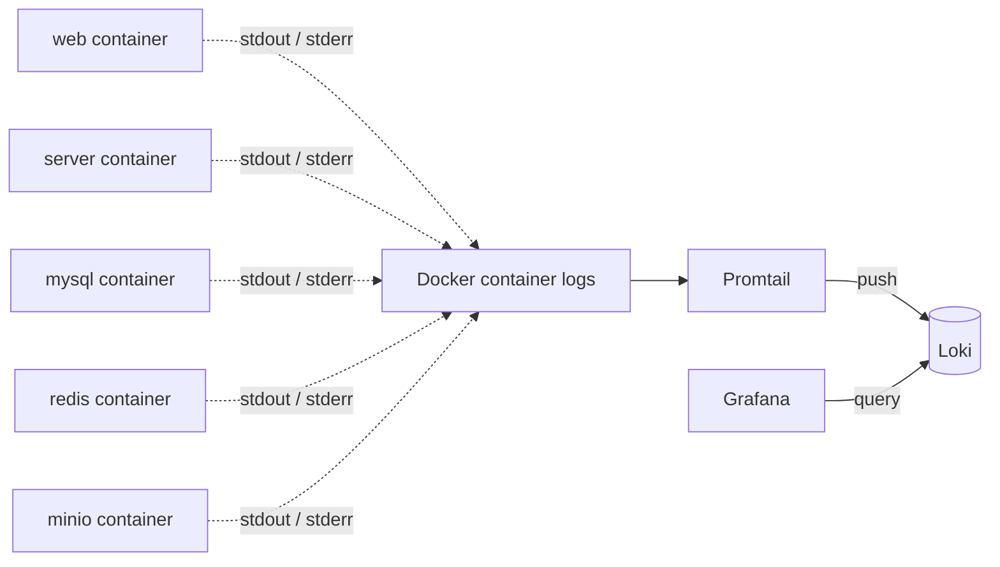
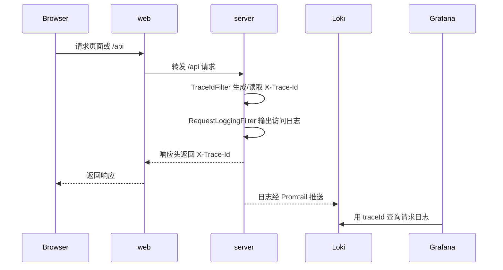

# 统一日志中心

项目使用 `Loki + Promtail + Grafana` 作为轻量级统一日志中心，用于集中查看 Docker 容器日志，并通过后端 `X-Trace-Id` 串联单次请求。

## 服务组成

- `loki`: 存储日志流并提供查询接口，默认访问 `http://localhost:${PLATFORM_LOKI_HOST_PORT}`。
- `promtail`: 读取 Docker 容器 stdout/stderr 日志并推送到 Loki。
- `grafana`: 提供日志查询 UI，默认访问 `http://localhost:${PLATFORM_GRAFANA_HOST_PORT}`。

## 日志流转



后端应用日志直接输出到容器 stdout，Promtail 统一读取 Docker 容器日志并推送到 Loki。Grafana 不保存日志本身，它通过 Loki datasource 查询日志。

## Trace Id 链路



## 启动

```bash
docker compose up -d --build
```

## 访问地址

- Grafana: `http://localhost:3000`
- Loki Ready: `http://localhost:3100/ready`
- Grafana 默认用户：`.env` 中的 `PLATFORM_GRAFANA_ADMIN_USER`
- Grafana 默认密码：`.env` 中的 `PLATFORM_GRAFANA_ADMIN_PASSWORD`

默认 Grafana 密码只适合本地开发。任何非本地部署都必须修改为更安全的密码。

## 常用 LogQL 查询

```logql
{container_name=~".*server.*"}
{container_name=~".*web.*"}
{container_name=~".*mysql.*"}
{container_name=~".*redis.*"}
{container_name=~".*minio.*"}
{container_name=~".*server.*"} |= "ERROR"
{container_name=~".*server.*"} |= "traceId=<value>"
```

## Trace Id

后端会读取请求头 `X-Trace-Id` 并在响应头中返回。如果请求没有携带该请求头，后端会自动生成一个 UUID trace id。

使用下面的命令查看响应头：

```bash
curl -k -i https://localhost:5172/api/auth/rsa-public-key
```

复制响应头里的 `X-Trace-Id`，然后在 Grafana 中查询：

```logql
{container_name=~".*server.*"} |= "traceId=<copied-trace-id>"
```

## 安全说明

- 不记录请求体。
- 不记录 multipart 文件内容。
- `password`、`token`、`jwt`、`secret`、`api_key`、`apikey`、`key`、`authorization` 等 query 参数会被脱敏。
- Promtail 只读挂载 Docker socket。
- `.env` 包含本地敏感信息，不能提交到 Git。
