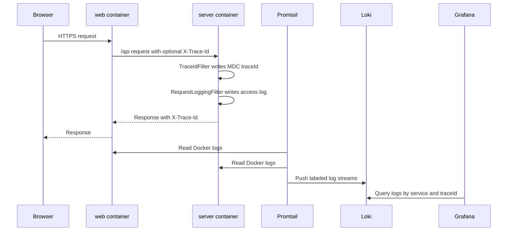

# Unified Logging Center Design

## Background

The project currently runs the frontend, backend, MySQL, Redis, and MinIO through Docker Compose. Logs are still scattered across container stdout and local development output. Troubleshooting depends on commands such as `docker compose logs server` and browser console checks.

This is enough for local debugging, but it is not enough for consistent issue diagnosis. Login failures, avatar upload failures, AI provider errors, database connection errors, and frontend proxy problems should be searchable from one place and correlated by request.

## Goals

- Add a lightweight unified logging center for local development and future deployment.
- Collect logs from `server`, `web`, `mysql`, `redis`, and `minio`.
- Provide a Grafana UI for searching logs by service, keyword, time range, and trace id.
- Add backend request tracing with `X-Trace-Id`.
- Add structured backend request logs containing request, response, duration, identity, and trace data.
- Document how to start, access, query, and troubleshoot the logging stack.

## Non-Goals

- Do not add full distributed tracing with Tempo, Jaeger, or Zipkin in this iteration.
- Do not add Prometheus metrics or alerting in this iteration.
- Do not archive logs to object storage in this iteration.
- Do not change frontend application logging behavior beyond container stdout collection.
- Do not change business logic or API response contracts.

## Recommended Architecture

Use `Loki + Promtail + Grafana`.

- `Loki` stores and indexes log labels and compressed log streams.
- `Promtail` discovers Docker containers and pushes their stdout/stderr logs to Loki.
- `Grafana` provides the query UI and uses Loki as a datasource.
- `server` writes normal application logs to stdout, including trace data through MDC.
- `web`, `mysql`, `redis`, and `minio` continue to write container logs to stdout/stderr.

This fits the current Compose architecture, keeps resource usage low, and avoids the operational overhead of Elasticsearch.

## Docker Compose Design

Add three services to the development Compose file:

- `loki`: exposes `3100`, persists data in a Docker volume, reads config from `ops/loki/loki-config.yml`.
- `promtail`: mounts Docker container log directories and Docker socket read-only, reads config from `ops/promtail/promtail-config.yml`, pushes to `http://loki:3100/loki/api/v1/push`.
- `grafana`: exposes `3000`, persists dashboard state in a Docker volume, provisions Loki datasource from `ops/grafana/provisioning/datasources/loki.yml`.

Add the same services to `docker-compose.prod.yml` unless production deployment chooses an external logging platform. The production Compose file should keep the same service names and internal endpoints.

Add volumes:

- `loki-data`
- `grafana-data`

Add environment variables in `.env`:

- `PLATFORM_LOKI_HOST_PORT=3100`
- `PLATFORM_GRAFANA_HOST_PORT=3000`
- `PLATFORM_GRAFANA_ADMIN_USER=admin`
- `PLATFORM_GRAFANA_ADMIN_PASSWORD=admin`

The Grafana default password is acceptable for local development only. Documentation must instruct changing it for real deployment.

## Backend Trace Design

Add a servlet filter that runs once per request:

- Read incoming `X-Trace-Id`.
- If absent or blank, generate a UUID-based trace id.
- Put the trace id into SLF4J MDC under `traceId`.
- Add `X-Trace-Id` to the response header.
- Clear MDC after request completion.

The trace filter must run before request logging and before most business logic so all downstream logs include the same trace id.

## Backend Request Log Design

Add a request logging filter that records one access log entry per request.

Fields:

- `traceId`
- `method`
- `path`
- `query`
- `status`
- `costMs`
- `clientIp`
- `userAgent`
- `userId` or username when available from Spring Security
- `error` when request processing throws

Rules:

- Do not log request bodies, passwords, JWT tokens, cookies, API keys, or file content.
- Log normal requests at `INFO`.
- Log 4xx responses at `WARN`.
- Log 5xx responses and thrown exceptions at `ERROR`.
- Skip or reduce noise for static assets and health checks if they become too noisy.

## Backend Log Format

Use `logback-spring.xml` to standardize console output.

Local development can keep a readable console pattern, but it must include:

- timestamp
- level
- thread
- logger
- traceId
- message

If JSON log encoding is added, use it for production profile or all profiles. The initial implementation can use a consistent text pattern because Promtail can still collect and label logs by container and service. The `traceId` field must be present in each backend log line.

## Log Query Examples

Grafana Loki queries:

- `{container_name=~".*server.*"}` shows backend logs.
- `{container_name=~".*web.*"}` shows frontend dev server logs.
- `{container_name=~".*mysql.*"}` shows MySQL logs.
- `{container_name=~".*minio.*"}` shows MinIO logs.
- `{container_name=~".*server.*"} |= "ERROR"` shows backend errors.
- `{container_name=~".*server.*"} |= "traceId=<value>"` finds all backend logs for one request.

## Files To Add

- `ops/loki/loki-config.yml`
- `ops/promtail/promtail-config.yml`
- `ops/grafana/provisioning/datasources/loki.yml`
- `backend/src/main/resources/logback-spring.xml`
- `backend/src/main/java/com/multimodal/interview/common/filter/TraceIdFilter.java`
- `backend/src/main/java/com/multimodal/interview/common/filter/RequestLoggingFilter.java`
- `docs/logging.md`

## Files To Update

- `docker-compose.yml`
- `docker-compose.prod.yml`
- `.env`
- `README.md`
- `backend/src/main/java/com/multimodal/interview/config/SecurityConfig.java` if explicit filter ordering is needed.

## Data Flow

## Error Handling

- If Loki is temporarily unavailable, Promtail retries and application containers continue running.
- If Grafana is unavailable, log collection continues and Loki remains the source of truth.
- If a request fails before authentication completes, the request log still includes `traceId`, method, path, status, and duration.
- If user identity is unavailable, the request log uses `anonymous`.

## Security Considerations

- Do not log secrets from `.env`.
- Do not log request bodies or multipart file content.
- Mount Docker socket as read-only for Promtail.
- Keep Grafana credentials configurable through `.env`.
- Document that default Grafana credentials must be changed outside local development.

## Testing And Verification

Configuration checks:

- `docker compose config --quiet`
- `docker compose -f docker-compose.prod.yml config --quiet`

Backend checks:

- Compile backend after adding filters and logback config.
- Add focused unit tests for trace id behavior and request logging behavior where practical.

Runtime checks:

- Start stack with `docker compose up -d --build`.
- Confirm `loki`, `promtail`, and `grafana` are running.
- Confirm Grafana is reachable at `http://localhost:3000`.
- Confirm Loki is reachable at `http://localhost:3100/ready`.
- Call `https://localhost:5172/api/auth/rsa-public-key`.
- Confirm response contains `X-Trace-Id`.
- Query Grafana/Loki for that trace id and find the backend request log.

## Acceptance Criteria

- All project services still start through Docker Compose.
- Grafana is accessible on the configured host port.
- Loki is accessible on the configured host port.
- Promtail collects logs from backend, frontend, MySQL, Redis, and MinIO containers.
- Backend responses include `X-Trace-Id`.
- Backend request logs include method, path, status, cost, client IP, user identity when available, and trace id.
- Documentation explains startup, access URLs, common queries, and security notes.

